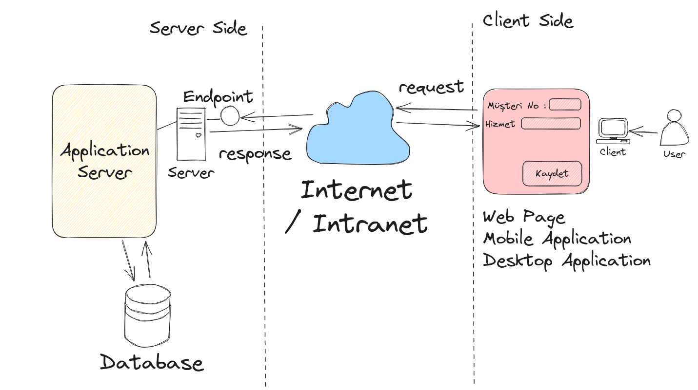
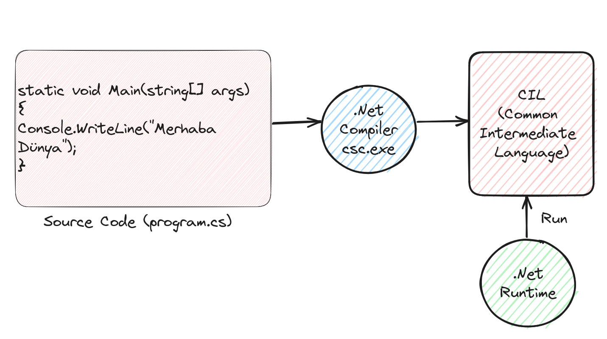

# Lesson_00 : Ders Notları

Ders sırasında üzerinde durduğumuz konulara ait kısa bilgiler.

## Çizimler

Kabaca bir client/server mimari düzeneğinden bahsettik.



C# ile yazılan bir kodun çalışma zamanına kadarki serüveninden yüzeysel olarak bahsettik.



## Sözlük

- OOP - Object Oriented Programming. C# , Java gibi nesne yönelimli bir dildir. Nesne yönelimli dillerin en önemli karaktresitikleri soyutlama _(Abstraction)_, kapsülleme _(Encapsulation)_, kalıtım _(Inheritance)_, çok biçimlilik _(Polymorphism)_ ilkeleridir.
- ERP _(Enterprise Resource Planning)_. Finans, muhasebe, satış sonrası hizmetler, insan kaynakları, üretim, envanter yönetimi, satış ve dağıtım gibi farklı iş alanlarındaki süreçlerin bir arada yönetildiği çözümlerin genel tanımlamasıdır. Çoğu ERP sisteminde bu modüller ayrıktır ve birbirleri ile mesajlaşarak iletişim kurarlar. Bu mesajlaşmalar üzerinden ortak süreçler de yönetilebilir. Bayi otomasyon sistemleri ERP çözümleri için güzel bir örnektir.
- github ve github Repository. Geliştiricilerin sosyal ağı olarak da yorumlanabilir. Diğer yandan CI/CD süreçlerini de içeren, takım çalışmalarını kolaylaştıran, kod kalitesini artırmak için Pull Request gibi mekanizmalara da sahip olan, açık kaynak(open source) ürünlerin sıklıkla konulduğu bir bulut çözümü olarak da düşünülebilir.
- Ubuntu _(Linux)_ Linus Torvalds tarafından açık kaynak olarak geliştirilmiş Linux işletim sistemi çekirdeğinin bir versiyonudur.
- Microsoft tarafından geliştirilmiş olan .Net Framework ve C# platform bağımsız çalışır _(Cross - Platform)_ . Dolayısıyla güncel .Net geliştirme ortamını kullanarak Windows, Linux, MacOS, ARM tabanlı pek çok sistemde kodlama yapabiliriz.
- Veritabanları RDBMS(Relational Database Management System), NoSQL olmak üzere genelde iki ana kategoriye ayrılırlar. İlişkisel veri tabanı modelleri ACID ilkelerini benimser ve çoğunlukla transactional olan süreçlerde ele alınırlar. Çooooook uzun zamandır hayatımızdadırlar. Şema bağımsız(Schemaless) veri modellerine de destek veren NoSQL sistemler BASE ilkelerini benimser ve özellikle dağıtık sistemlerde CAP teoremine göre yer bulurlar. NoSQL tarafında Document Based, Key-Value, Colum-Family, Graph, Time Series temelli farklı modeller vardır.
- C# derlenebilir bir dildir. _(Compiler söz konusudur)_ Bir başka deyişle yazılan kodlar öncelikle bir derleme işlemine tabii tutulur ve ara dilden komut setlerini de barındıran bir çıktı haline gelir. Bu çıktı .Net Runtime tarafından çalıştırılabilir.
- Framework - Programları yazmamızı kolaylaştıran kütüphaneler _(libraries)_ topluluğu olarak düşünülebilir. .Net Framework ile her tür programı yazabiliriz. Diğer yandan framework'ler kullanılarak belli domain'lerdeki çözümlere özel geliştirilmiş framework'ler de vardır.
- Sistemde .Net ortamının yüklü olup olmadığını anlamak için terminalde **dotnet --version** komutu işletilebilir.
- MVC _(Model View Controller)_
- SPA _(Single Page Application)_
- MD Markdown formatındaki dosyalardır. Şu an okumakta olduğunuz dosya bu formattadır. Github gibi ortamlarda sıklıkla kullanılır. Ayrıca Rust dilinin tüm dokümantasyonu ve yardım baloncukları Markdown formatındadır.

## Yardımcı Linkler

Ders sırasında baktığımız yardımcı linkler aşağıdaki gibidir.

- .Net platformunu sisteme yüklemek için -> https://dotnet.microsoft.com/en-us/
- .Net plaformu için C# ile kod yazmamızı kolaylaştıran VS Code -> https://code.visualstudio.com/

## Kullandığımız Komutlar

```bash
# sistemde yüklü dotnet sürümünü öğrenmek için
dotnet --version

# dotnet ile açabileceğimiz proje şablonlarını-template öğrenmek için  
dotnet new list 

# eski stilde bir console projesi açmak için
dotnet new console --use-program-main -o hello_world

# yeni nesil console projesi açmak için
dotnet new console -o hello_world_2

# bir dotnet projesini çalıştırmak için
dotnet run 

# ortak repomuzu sisteminize indirmek için
git clone https://github.com/buraksenyurt/akademi
```

## Lesson_01'e Kadar ki Ödevler

- Internet ve Intranet arasındaki farklar nelerdir? 500 kelimeyi geçemeyecek şekilde açıklayınız.
- Sistemlerimize .Net yüklenmeli. Ayrıca geliştirme IDE'si olarak Visual Studio Code.
- Olmayanlar kendilerine bir github hesabı açmalılar.