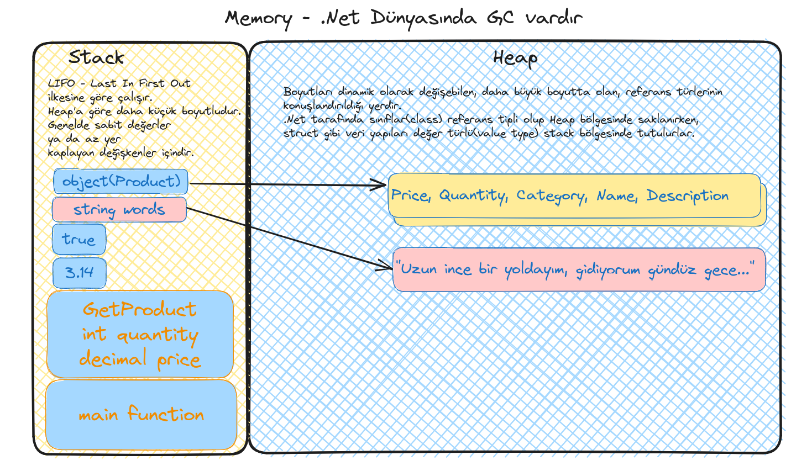

# Lesson_02

Bu derste temel veri tiplerine, değişken tanımlamalarına baktık. Terminalden input alıp ekrana basmayı denedik. Convert işlemlerinde oluşup programı kırabilecek exception durumuna baktık. Ayrıca stack ve heap kavramlarından, GCden, değişkenlerin bellekte nasıl konuşlandırıldığından bahsettik.



## Sözlük

- .Net Runtime; Derlenmiş olan .Net kodlarının işleticisidir. İstisna yönetimi(Exception Handling), bellek yönetimi(Garbage Collector), çalışma zamanının işletilmesi gibi süreçlerin ele alındığı yerdir.
- Primitive Types (Sistemin kendi sunduğu en temel tipler. integer, string, double, float, decimal, short, char, bool vs)
- Data Structure (Programcı tarafından tasarlanabilen veri modelleri)
- GC (Garbage Collector) - C#, Java, Go gibi dillerde bellek bir mekanizma tarafından yönetilir. İşi biten nesnelerin bellekten atılması dolayısıyla onlara ait bellek alanlarının serbest bırakılması ya da nesnelerin belleğe yerleştirilmesi, belleğin optimize edilmesi gibi işlemler GC tarafından yapılır. Tam aksine C, C++, Rust gibi dillerde GC mekanizmaları yoktur bellek yönetimi daha farklı kurallarla işletilir ve programcının sorumluluğu daha fazladır.

## Yardımcı Linkler(Bilgiler)

- C# programlama dilini çevrimiçi deneyimlemek için başlangıç adresi -> https://dotnet.microsoft.com/en-us/learn/dotnet/in-browser-tutorial/1
- Programlama dilleri listesi -> https://www.tiobe.com/tiobe-index/
- Visual Studio Code ortamında kod içeriğini formatlamak için Ctrl + Shift + I kullanılabilir(Linux tarafı)
- Visual Studio Code ortamında kodları yorum satırına almak için Ctrl + K + C tam tersi Ctrl + K + U.
- Tüm kısa yollar için yardımcı kaynak -> https://code.visualstudio.com/shortcuts/keyboard-shortcuts-windows.pdf 
- Genel hatları ile C# tarafındaki primitive tiplerin listesi -> https://learn.microsoft.com/en-us/dotnet/csharp/language-reference/builtin-types/built-in-types 


## Kullandığımız Komutlar

```shell
# Bu ders için açtığımız örnek console projesi
dotnet new console -o ShopApp

# Yazdığımız programı derlemek için
dotnet build
```

## Araştırsak İyi Olur

- .Net primitive veri tipleri nelerdir, değer aralıkları nedir, keyword karşılıkları nelerdir bir bakalım.