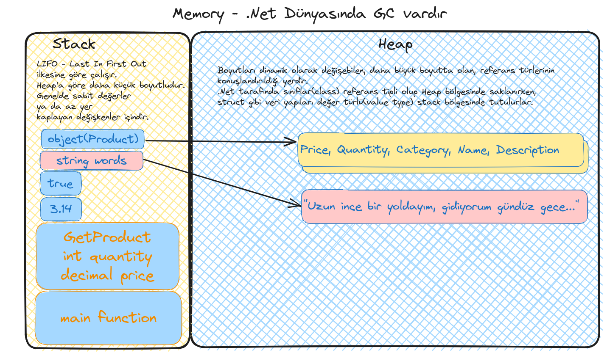
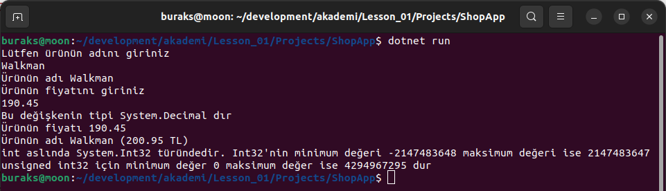

# Lesson_01 : Değişken Tanımlama, İlkel Veri Türleri, Tip Dönüşüm Sorunları

Bu derste temel veri tiplerine ve değişken tanımlamalarına baktık. Terminalden girdi _(input)_ alıp ekrana yazdırmayı denedik. Convert işlemlerinde programı kırabilecek istisnalara _(Exception)_ durumuna baktık. Ayrıca bellek yönetiminde önemli bir konu olan stack ve heap kavramlarından, Garbage Collector mekanizmasından ve dolayısıyla değişkenlerin bellekte nasıl konuşlandırıldığından bahsettik.



## Sözlük

- .Net Runtime; Derlenmiş olan .Net kodlarının işleticisidir. İstisna yönetimi(Exception Handling), bellek yönetimi(Garbage Collector), çalışma zamanının işletilmesi, tip kontrollerinin yapılması gibi süreçlerin ele alındığı yerdir.
- Primitive Types _(Sistemin kendi sunduğu en temel tiplerdir. integer, string, double, float, decimal, short, char, bool vs bunlar arasında yer alır)_
- Data Structure: Programcı tarafından tasarlanabilen veri modelleri olarak düşünebiliriz. En temelde class ve struct olarak düşünülebilirler.
- GC _(Garbage Collector)_ : C#, Java, Go gibi dillerde nesnelerin bellekteki yaşamları bir mekanizma tarafından yönetilir. İşi biten nesnelerin bellekten atılması dolayısıyla onlara ait bellek alanlarının serbest bırakılması ya da nesnelerin belleğe yerleştirilmesi, belleğin optimize edilmesi gibi işlemler GC mekanizmasının görevleri arasındadır. Tam aksine C, C++, Rust gibi dillerde GC mekanizmaları yoktur ve bellek yönetimi daha farklı kurallarla işletilir. Bu ortamlarda programcının sorumluluğu daha fazladır. Bellekteki nesne yönetimi iyi yapılmazsa veya eksik yapılırsa bazı güvenlik açığı riskleri oluşabilir. Tarihteki ilk solucan olarak kabul edilen Morris Buffer Overflow açığını kullanmıştır. Popüler açıklara sebebiyet veren durumda double free, use after free, dangling pointer ve buffer overflow halleridir.

## Yardımcı Linkler

Ders sırasında baktığımız linkler aşağıdaki gibidir.

- [C# programlama dilini çevrimiçi deneyimlemek için başlangıç adresi](https://dotnet.microsoft.com/en-us/learn/dotnet/in-browser-tutorial/1)
- [Programlama dilleri listesi](https://www.tiobe.com/tiobe-index/)
- [Tüm kısa yollar için yardımcı kaynak](https://code.visualstudio.com/shortcuts/keyboard-shortcuts-windows.pdf)
- [Genel hatları ile C# tarafındaki primitive tiplerin listesi](https://learn.microsoft.com/en-us/dotnet/csharp/language-reference/builtin-types/built-in-types)

## VS Code Tarafında Kullandığımız Bazı Kısayollar

- Visual Studio Code ortamında kod içeriğini formatlamak için Ctrl + Shift + I kullanılabilir _(Linux tarafı)_
- Visual Studio Code ortamında kodları yorum satırına almak için Ctrl + K + C tam tersi Ctrl + K + U.

## Kullandığımız Komutlar

```shell
# Bu ders için açtığımız örnek console projesi
dotnet new console -o ShopApp

# Yazdığımız programı derlemek için
dotnet build

# Yazdığımız uygulamayı çalıştırmak için
dotnet run

# bu projeyi soluiton'a eklemek için akademi klasöründeyken
# aşağıdaki komutu çalıştırmak yeterlidir
dotnet sln add Lesson_01/Projects/ShopApp/
```

## Çalışma Zamanı

Bu derste işlenen örnek kodların çalışma zamanı çıktısı aşağıdaki gibidir.



## Araştırsak İyi Olur

- .Net primitive veri tipleri hangileridir, değer aralıkları nedir, keyword karşılıkları nasıldır bir bakalım.
- Birkaç veri tipinin max, min değer aralıklarını ekrana yazdıran basit bir terminal uygulaması geliştirmeye çalışalım.

## Kazanımlar

- Stack ve Heap bellek bölgeleri
- Değişken tanımlama ve kullanımı ile temel veri türleri
- Enum veri türünün basit kullanımı
- Terminalden girdi okuma ve yazdırma işlemleri