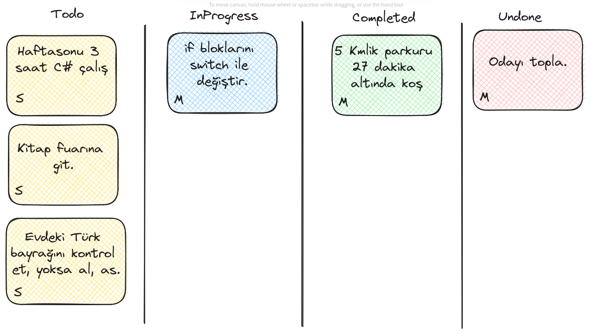
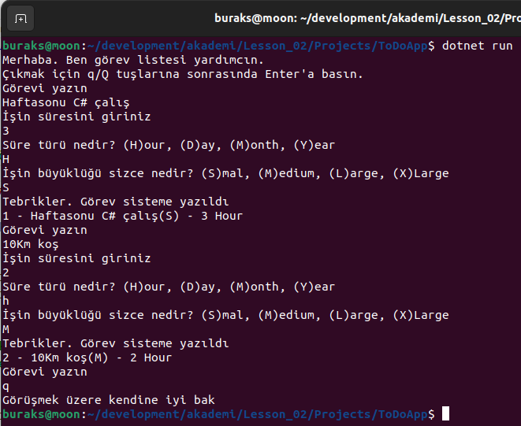

# Lesson_02 : Değişken Tanımları, Veri Türleri, Sonsuz Döngüler, Basit Koşullu İfadeler, TodoApp Giriş

Bu derste bir önceki derste yaptıklarımızın üstüne koyarak bir ToDo uygulamasının temellerini atmaya çalıştık. İlk amacımız if,else, sonsuz döngü, değişken dönüşümleri, input almak gibi işlevleri yapabilmek. Kodumuz olabildiğince kirli durumda. Daha iyi hale getirmek için gereklilikleri ortaya koymaya çalışıyoruz. Derste işlediğimiz örnek özelinde aşağıdaki temadan esinlendiğimizi söyleyebiliriz.



## Uygulamanın Handikapları

- Her şeyi main içerisinde yapıyoruz.
- Yeniden kullanılabilirlik (Reusability) yok.
- Çok fazla if,else bloğu var.
- Kod tekrarları fazla.
- Görev bilgileri sadece değişkenlerde tutuluyor.

## Sonraki Derste Hedefler

- Görev bilgilerinin nesnel olarak tutulmasını sağlamak.
- Girilen görevleri bir listeye(diziye alıp) program yaşamı boyunca saklamak.

## Sözlük

- .Net veri türleri için CTS(Common Type System) adı verilen mekanizmayı kullanılır.
- var keyword'ü ile tanımlanan değişkenler derleme zamanında eşitliğin sağ tarafındaki veri içeriğine göre otomatikman set edilir. dynamic keyword ise bunu çalışma zamanında(runtime) yapar. Daha çok reflection konusunda işimize yarar ve kullanılır.
- User Story: Genellikle çevik metodolojilerde sıklıkla kullanılır. Ürün sahibi ya da iş sahibi elindeki feature'dan ne beklediğini açıkça belirtir. Örneğin, "Müşteri olarak ana ekrana girdiğimde arama kutucuğuna ürün adını yazdığımca önerilerin otomatik olarak çıkmasını istiyorum" gibisinden. Bunun biraz daha detaylı ve iyi ifadesi programcıya kodlamayı nasıl yapacağına dair fikirler verir, bunla ilgili ipuçları barındırır.
- Agile metodolojiler: Günümüz iş modellerinin çoğu Waterfall yerine Agile(Çevik) metodolojilerle geliştirilmektedir. En yaygın kullanılanları arasında Kanban ve Scrum vardır.
- Oyun motorlarında her kareyi ele alan hep bir sonsuz döngü vardır.
- Dönem derslerini şu an için aynı Solution altında topluyoruz. Eklediğimiz tüm C# projelerini bu Solution içerisine alabiliriz. Bir solution genelde aynı alana(domain) ait birden fazla projeyi içerebilir.

## Yardımcı Linkler

## Kullandığımız Komutlar

```bash
# Console uygulamamızı aşağıdaki terminal komutu ile açtık
dotnet new console -o ToDoApp --use-program-main

# kodları derlemek için
dotnet build

# uygulamayı çalıştırmak için
dotnet run

# bu projeyi soluiton'a eklemek için akademi klasöründeyken
# aşağıdaki komutu çalıştırmak yeterlidir
dotnet sln add Lesson_02/Projects/ToDoApp/
```

## Çalışma Zamanı

Bu derste işlenen kodların çıktısı aşağıdaki gibidir.



## Araştırsak İyi Olur

- if else bloğu yerine switch bloğu ile nasıl ilerleriz. Lütfen kodun içerisindeki TODO kısmına bakınız.

## Evde Çalışmak için Atıştırmalıklar

- Bu dersteki örnekten esinlenerek kitaplarınız için bir program yazmayı deneyebilirsiniz. Ekrandan kitaba ait bir takım bilgileri alıp bunları doğru türdeki değişkenlerde saklayan ve sonucu ekrana bastıran, kullanıcının istediği kadar kitap girebildiği bir süreç tasarlayabilirsiniz. Bonus olarak kitap ve yazar arasındaki olası çoklu ilişkiyi(many-to-many relation) şu ana kadar gördüğümüz enstrümanlarla tesis edip edemeyeceğimizi araştırabilirsiniz.

## Kazanımlar

- while döngü yapısı ve sonsuz döngü oluşturarak sürekli girdi almak
- temel koşullu ifadelerin kullanımı (if,else)
- Tipler arası dönüştürmede olası hatalar ve TryParse kullanımı ile güvenli dönüşümler
- İlkel seviyede sınıf (class) tanımlaması ve gerçek hayat kavramlarının kodsal temsili