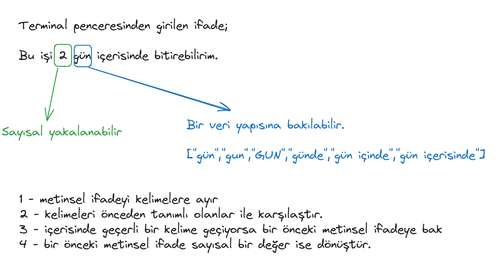
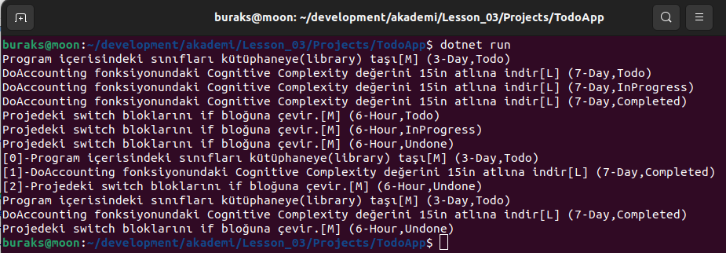

# Lesson_03 : Sınıf Tasarlama, Nesne Örneği Oluşturma, Sınıf Fonksiyonları Kullanma

Bir varlığı kod tarafında nasıl temsil edebileceğimizi öğrenmeye devam ediyoruz. Buna istinaden bir görevin(Task) sınıf olarak tasarımı üzerinde durduk. Görev ile ilişkili bazı fonksiyonları (metotları) nasıl tanımlayabileceğimiz ve nasıl kullanabileceğimizi inceledik. .Net tür sisteminde her şeyin bir Object olduğundan, yani Object sınıfından türediğinden bahsettik ancak OOP temelleri olan kavramlara (Inheritance, Encapsulation, Polymorphism) gibi konulara değinmedik. Son noktada Task türünden nesne örneklerini sınırlı boyutta bir dizide toplayıp, dizi elemanları üzerinde ileri yönlü iterasyon için for ve foreach döngülerini kullandık. İlerleyen derste hedefimiz Task türü ile ilgili tipleri ayrı bir kütüphaneye almak, fonksiyonlar için testler üretmek(dolayısıyla unit test-birim test yazımını öğrenmek), dizi yerine generic List koleksiyon yapısını kullanmak.

Bu arada derste gelen bir soru üzerine metinsel bir ifadenin içinden kodsal anlamı olan çıktılar üretmek adına nasıl bir yol izleyebileceğimizi tartıştık. 



## Sözlük

- Python gibi yorumlayıcılı (Interpreter) kullanan betik (script) diller ile girilen ifadenin anında çalıştırılıp sonuçların alınması mümkündür. Yorumlayıcılar genelde REPL adı verilen sistemi kullanırlar.
- Her şey nesnedir(object). Örnekte kullandığımız Task sınıfı aslında bir nesnedir(object). object, .Net tip sisteminde Object sınıfı ile ifade edilir ve her veri tipi esasında dolaylı olarak Object sınıfından türer(Inheritance).
- Optional Parameter senaryosu:

## Yardımcı Linkler

Bu ders genelde Visual Studio Code tarafında kaldık.

## Kullandığımız Komutlar

Ders boyunca terminalden yürüttüğümüz komutlar aşağıdaki gibidir.

```shell
# Bir önceki derste olduğu gibi
dotnet new console --use-program-main -o TodoApp

# Projeyi solution'a eklemek için
dotnet sln add Lesson_03/Projects/TodoApp/

# proje veya çözümü derlemek için
dotnet build

# çalıştırmak için
dotnet run
```

## Çalışma Zamanı

Derste işlenen kodların çalışma zamanı çıktısı aşağıdaki gibidir.



## Araştırsak iyi Olur

- Bir ifadenin kod tarafından yorumlanması. Örneğin terminalden **"5 saat"** ya da **"işi 2 gün içinde bitirebilirim"** yazdığımızda, bu cümlelerden işin süresini ve süresinin tipini bulabilir miyiz?
- Script tabanlı dillerin neler olduğuna bakılabilir. REPL nedir, ne işe yarar?
- public erişim belirleyicisine ders sırasında değindik. Diğer erişim belirleyicileri hangileridir bir bakalım, ne amaçlarla kullanılır öğrenelim.
- Auto Property nedir bir bakalım. AutoProperty ile otomatik oluşturulan get,set bloklarını manuel oluşturarak Task sınıfının aynısını yazmaya çalışalım.

## Evde Çalışmak için Atıştırmalıklar

- Uygulamadaki tasks dizisini dolaşan for ve foreach döngüleri yerine while ve do..while döngülerini kullanmayı deneyebilirsiniz. Ayrıca bu kod parçasına bir metot içerisine taşıyabilirsiniz.

## Ödev (Bu ödev ders geçme notuna doğrudan etki eder)

TodoApp kodlarından esinlenerek, sevdiğimiz kitapların bilgisini taşıyan bir sınıf tasarlayın. Bu sıfına ait kod içerisinde en az 3 nesne örneği oluşturun. Book isimli sınıfta bir kitaba ait, isim, yazar(lar), fiyat, sayfa sayısı, kategori bilgilerini taşıyan özellikler(properties) yer alsın. Kitaba belli bir oranda indirim uygulayan bir metot olsun. Main içerisinde tanımladığımız ne kadar kitap varsa hepsine aynı oranda indirim uygulayacak bir başka metot daha geliştirin. Bu metod Book sınıfı içerisinde olmamalı.

|Kriter                  | Açıklama                           |
|------------------------|------------------------------------|
|**Platform:**           |Bağımsız (Windows/Linux/MacOS)      |
|**Son Teslim Süresi:**  |Dönem sonuna kadar                  |
|**Kabul Kriterleri:**   |Yazılan kodun çalıştırılabilir olması ve istenen fonksiyonellikleri sunması gerekmektedir.|
|**Ulaştırma Şekli:**    |Dosya olarak ulaştırılabilir. Portale yüklenebilir.|
|**Bonus:**              |Github adresinden ödev paylaşımı ve yapılanların Readme.md dosyasında anlatılması ekstra 20 puan anlamına gelir.|
|**Geçme Notuna Etkisi:**| %10                                |

## Kazanımlar

- Sınıf tasarlama, nesne örnekleri oluşturma
- Auto Property ve Readonly özellik kullanımları
- Nesne metotlarının yazılması ve kullanımı
- Temel seviyede dizi tanımlama, dizi elemanları üzerinde döngüsel ilerleme
