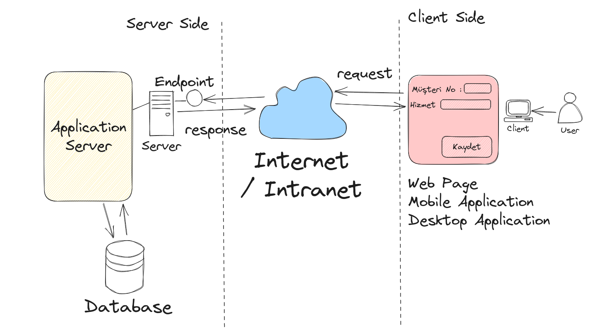

# Lesson_03 : Sınıf Tasarlama, Nesne Örneği Oluşturma, Sınıf Fonksiyonları Kullanma

Bir varlığı kod tarafında nasıl temsil edebileceğimizi öğrenmeye devam ediyoruz. Buna istinaden bir görevin(Task) sınıf olarak tasarımı üzerinde durduk. Görev ile ilişkili bazı fonksiyonları (metotları) nasıl tanımlayabileceğimiz ve nasıl kullanabileceğimizi inceledik. .Net tür sisteminde her şeyin bir Object olduğundan, yani Object sınıfından türediğinden bahsettik ancak OOP temelleri olan kavramlara (Inheritance, Encapsulation, Polymorphism) gibi konulara değinmedik.

Derste gelen bir soru üzerine metinsel bir ifadenin içinden kodsal anlamı olan çıktılar üretmek adına nasıl bir yol izleyebileceğimizi tartıştık. 



## Sözlük

- Python gibi yorumlayıcılı (Interpreter) kullanan betik (script) diller ile girilen ifadenin anında çalıştırılıp sonuçların alınması mümkündür. Yorumlayıcılar genelde REPL adı verilen sistemi kullanırlar.
- Her şey nesnedir(object). Örnekte kullandığımız Task sınıfı aslında bir nesnedir(object). object, .Net tip sisteminde Object sınıfı ile ifade edilir ve her veri tipi esasında dolaylı olarak Object sınıfından türer(Inheritance).

## Yardımcı Linkler

_Ders sırasında uğradığımız sayfalar varsa linkleri paylaşılır_

## Kullandığımız Komutlar

Ders boyunca terminalden yürüttüğümüz komutlar aşağıdaki gibidir.

```shell
# Bir önceki derste olduğu gibi
dotnet new console --use-program-main -o TodoApp

# proje veya çözümü derlemek için
dotnet build

# çalıştırmak için
dotnet run
```

## Araştırsak iyi Olur

- Bir ifadenin kod tarafından yorumlanması. Örneğin terminalden **"5 saat"** ya da **"işi 2 gün içinde bitirebilirim"** yazdığımızda, bu cümlelerden işin süresini ve süresinin tipini bulabilir miyiz?
- Script tabanlı dillerin neler olduğuna bakılabilir. REPL nedir, ne işe yarar?
- public erişim belirleyicisine ders sırasında değindik. Diğer erişim belirleyicileri hangileridir bir bakalım, ne amaçlarla kullanılır öğrenelim.

## Evde Çalışmak için Atıştırmalıklar

_Meraklısına evde çalışması için verilecek örnekler buraya yazılır_