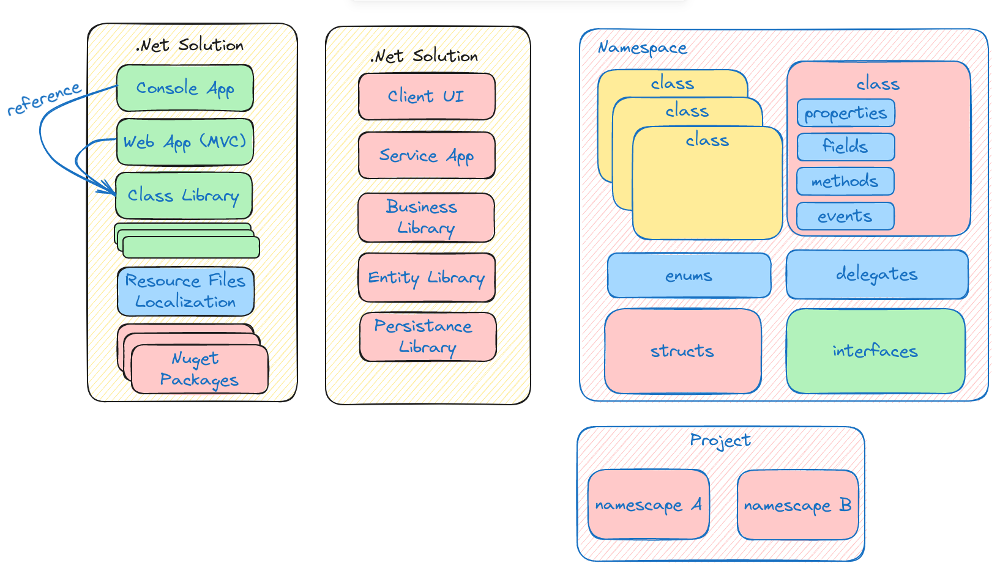
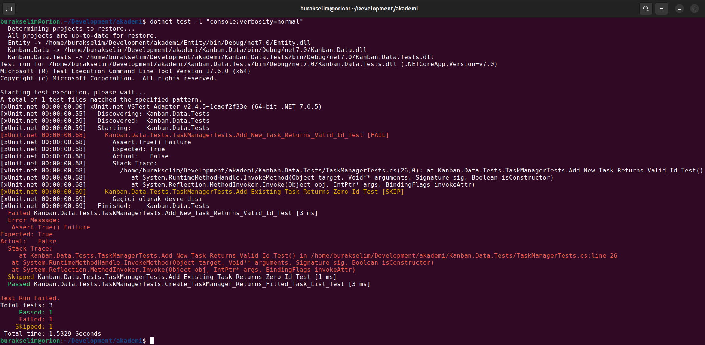

# Lesson_04 : Sınıf Kütüphaneleri ve Birim Testler

Bu derste bir solution içerisinde yer alabilecek proje yapılarından, Kanban board'a konu olan POCO türlerinin ayrı bir sınıf kütüphanesinde konuşlandırılmasından, task yönetimi ile ilgili yeni bir kütüphane oluşturup buna ait birim testlerin nasıl ele alınabileceğinden bahsettik. Yüksek kalitede, bakım maliyeti düşük, iş biriminin çeşitli kabul kriterlerini karışalayan ve code coverage değerleri yüksek çıktılarda birim testlerin önemine vurgu yaptık. Çok basit manada ilk birim test metotlarımızı yazmayı da denedik. Bir solution içerisindeki temel yapı taşları ile, namesace örgüsü ve iç enstrümanlarını da aşağıdaki grafikle özetlemeye çalıştık.



## Sözlük

- **sln :** Bir .net solution dosyasıdır. Bir solution içerisinde birden fazla proje yer alabilir. Bu projeler sln dosyası içerisinde de bildirilir.
- **csproj :** Bir .net projesine ait bilgiler içeren dosyadır. Örneğin projenin referans ettiği diğer kütüphaneler veya nuget paketlerinin bildirimleri, .net framework sürümü, null değer kullanılıp kullanılmayacağı vb bilgiler bu dosya içerisinde yer alır.
- **POCO(Plain Old CLR Objects)** : Sadece property/field barındıran herhangi bir işlevsellik içermeyen sınıflardır.
- **Birim Test(Unit Test) :** Yazdığımı metotların belirli kriterlere göre doğru şekilde çalıştığından emin olmak için kabul kriterlerine istinaden test metotlarının yazılması gerekir. Test metotları birim test olarak da bilinir.

## Yardımcı Linkler

- VS Code tarafında .Net projeleri ile çalışırken yardımcı olacak pek çok eklenti var. Bunlarda birisi de [C# Dev Kit](https://marketplace.visualstudio.com/items?itemName=ms-dotnettools.csdevkit). 
- .Net eko sisteminin paket yönetim hizmeti Nuget'tir ve [şu adresten](https://www.nuget.org/) erişilebilir. Bir çok konuda çözüm sunan paketlere nuget repolarından erişebilir ve projelerde kullanabiliriz. Örneğin RabbitMQ, Entity Framework, JSON gibi ile işlerle uğraşırken tekerleği yeniden icat etmek yerine bu alanlara özel yazılmış Nuget paketlerinden faydalanılabilir. Bazı firmalar kendi nuget repolarını açar ve internal kütüphanelerini bu repolarda tutarak geliştirmeler yapar.

## Kullandığımız Komutlar

Ders boyunca terminalden yürüttüğümüz komutlar aşağıdaki gibidir.

```shell
# dotnet ile oluşturabileceğimiz proje listesini görmek için
dotnet new list

# yeni bir class library açmak için
dotnet new classlib -o Entity

# projeyi solutiona'a eklemek için
dotnet sln add Entity/Entity.csproj

# bu dersteki console uygulamasını oluşturmak için
dotnet new console -o KanbanApp

# Proje klasöründeyken Entity projesini referans edebiliriz
cd KanbanApp
dotnet add reference ../../../Entity/Entity.csproj

# Console projesini solution'a eklemek içinse solution klasöründeyken
dotnet sln add Lesson_04/Projects/KanbanApp/KanbanApp.csproj

# Kanban operasyonlarını barındıracak class library projesini açmak için
dotnet new classlib -o Kanban.Data
# Kanban.Data projesini solution'a eklemek için
dotnet sln add Kanban.Data/Kanban.Data.csproj
# Kanban.Data projesi, Entity projesi içindeki tipleri de kullanacağından
# Kanban.Data projesine Entity projesini referans etmek gerekir.
cd Kanban.Data
dotnet add reference ../Entity/Entity.csproj

# xunit şablonunda test projesi açmak için
dotnet new xunit -o Kanban.Data.Tests

# test projesinin solution'a eklenmesi
dotnet sln add Kanban.Data.Tests/Kanban.Data.Tests.csproj

# test projesine gerekli diğer projelerin referans edilmesi
dotnet add reference ../Kanban.Data/Kanban.Data.csproj
dotnet add reference ../Entity/Entity.csproj

# proje veya çözümü derlemek için
dotnet build

# Solution içerisindeki testleri çalıştırmak için
dotnet test

# testle ilgili detay bilgiyi console'a yazdırmak için
dotnet test -l "console;verbosity=normal"
```

## Çalışma Zamanı

Derste ilk birim test metotlarımızı TaskManager sınıfı üzerinden incelemeye çalıştık. Geldiğimiz nokta itibariyle aşağıdaki sonuçları elde ettik.



## Araştırsak iyi Olur

- TDD (Test Driven Development) yaklaşımı geliştirilecere nasıl avantajlar sağlar, dezavantajları var mıdır, araştıralım. TDD kaynaklarda Red Green Blue development olarak da geçer. Önce kodun hata alarak yazılması sağlanır, sonra hata düzeltilerek doğru çalışması gerçeklenir. Son aşamada da kod refactor edilir yani iyileştirilir.
- Code Coverage nedir neden önemlidir araştıralım.

## Evde Çalışmak için Atıştırmalıklar

- Fibonacci sayı dizisini yazdıran bir metot ve bu metodun birim testini içeren bir örnek geliştirebilirsiniz. Fibonacci serisi 0, 1, 1, 2, 3, 5, 8, 13, 21 şeklinde ilerleyen sayı dizisidir. Altın oranla arasında yakın bir ilişki vardır ve bu sebeple doğada da izlerine rastlanır diyebiliriz. Detaylar için [Math Is Fun](https://www.mathsisfun.com/numbers/fibonacci-sequence.html) adresine bakabilirsiniz. Metodunuz belirli sayı kadar seriyi yazdıracak şekilde tasarlanmalı. Yani 50 değerini verirsek Fibonacci serisinin ilk 50 sayısını yazdırmalı. Test metodu da yazılacağından geriye n tane Fibonacci sayısını içeren bir dizi döndüren metot yazarsanız doğru bir yaklaşım olacaktır.

## Kazanımlar

- Solution iskeleti, namespace kavramı ve içeriği hakkında temel bilgiler.
- Birim test nedir, nasıl yazılır, hangi ihtiyaçları karşılamak için kullanılır.
- Yapıcı metot *(Constructor)* nedir, hangi amaçlarla kullanılır, aşırı yüklenmiş *(Overloaded)* versiyonları ne işe yarar?