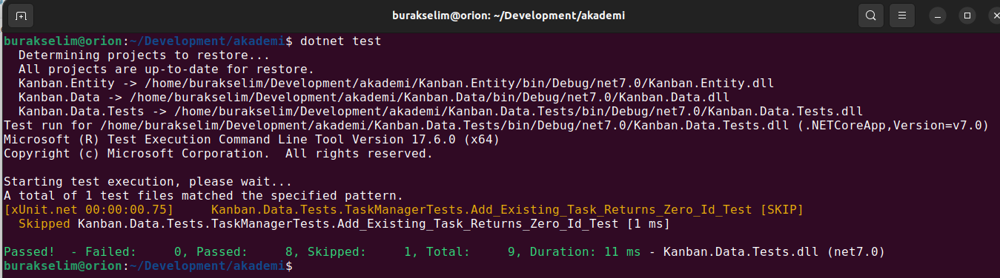

# Lesson_05 : Generic List Kullanımı ve Daha Çok Test

Bu derste önceki derste başladığımız ve genel olarak bir Kanban bordunun basit yönetimi için gerekli metotları sunan WorkItemManager sınıfının birim testlerini tamamlamaya çalıştık. Testleri ilk çalıştırmalarda Fail durumuna düşürüp sonrasında Success durumuna gelecek şekilde düzenledik. Ardından kodu build warning mesajları ve VS Code önerileri doğrultusunda iyileştirmeye çalıştık. Bir nebze Red Green Blue tekniği ile ilerledik. Red-Green-Refactor olarak da adlandırılan ve TDD'nin önemli bir parçası olan bu teknikle ilgili [şu adreste](https://www.codecademy.com/article/tdd-red-green-refactor) oldukça güzel bir kaynak da yer alıyor. 

Dersin bu kısmına gelen kadar veri serilerini tutmak için elimizde Array türü bulunuyordu. Bu derste boyutları dinamik olarak değişebilen, tür güvenli generic koleksiyonlardan yararlanmaya çalıştık. Bu amaçla WorkItem nesnelerini bir List koleksiyonunda depoladık. İlerleyen derslerdeki hedeflerimizden birisi de, WorkItem bilgilerini fiziki bir depolama ortamından okumak ve yine bu ortama yazmak. İlk akla gelen veritabanı olmakla birlikte dosya girdi çıktı işlemlerinin de öğrenilmesi için Comma Seperated File türünde dosyalardan yararlanmayı planlıyoruz.

## Sözlük

- **Generic Koleksiyonlar :** Stack *(LIFO yani Last in First Out ilkesine göre çalışır)* , Queue *(First In First Out ilkesine göre çalışır)* , List *(En genel nesne koleksiyonlarındandır)*, Dictionary *(Key-Value çiftleri şeklinde nesneleri tutar)*, HashSet *(Key-Value modeli gibi çalışan ama sıralamada hash değerlerini kullanan bir koleksiyon)* gibi popüler koleksiyon türleri söz konusudur. Generic koleksiyonlar normal koleksiyon türlerinden farklı olarak örneklenirken verilen tür ne ise onunla ilgili nesne örnekleri tutar. Buna göre örneğin **List< Product >** şeklinde bir generic liste tanımlarsak, List sınıfının tüm metotları Product tipi ile çalışabilir hale gelir. Bu önemlidir nitekim her ayrı tip için ayrı bir List sınıfı yazmak yerine .Net içinde generic tanımlanmış tek bir List sınıfı kullanılır. List sınıfının Add metodunun parametresi WorkItem türündendir.
- **Kendi generic türlerimizi de yazabiliriz.** Generic sınıflar, generic arayüzler, generic metotlar, generic temsilciler vb
- Generic türlerde kıstaslar da *(Constraints)*  kullanılabilir. Yani generic tipin *(Genellikle < T > şeklinde ifade edilen)* belli kriterlere mutlaka uyması da sağlanabilir. Örneğin T mutlaka sınıf olmalı ya da T tipi mutlaka varsayılan yapıcı metoda sahip olmalı veya T tipi mutlaka belirtilen bir tipten türetilmiş olmalı.
- **Guid :** Globally Unique Identifier
- **LINQ :** Language INtegrated Query. Genişletme metodları (extension methods) ve Lambda operatörünün ( => ) kullanımı ile nesne dizeleri üzerinde SQL sorguları yazar gibi sorgulamalar çalıştırabiliriz. Filtrelemeler, aramalar, gruplama fonksiyonları vs gibi işlevsellikleri ele alabiliriz. Bu derste List koleksiyonu üzerinden Where, Count ve SingleOrDefault metotlarını kullandık.

## Yardımcı Linkler

- .Net içerisinde yer alan tüm isim alanlarına ve içeriklerine [şu adresten](https://learn.microsoft.com/en-us/dotnet/api/?view=net-8.0) bakabiliriz.

## Kullandığımız Komutlar

Ders boyunca terminalden yürüttüğümüz komutlar aşağıdaki gibidir.

```shell
# proje veya çözümü derlemek için
dotnet build

# çalıştırmak için
dotnet run

# testleri koşturmak için
dotnet test
```

## Çalışma Zamanı

Ders boyunca amacımız olası kabul kriterlerine göre test metotlarını tamamlamak ve WorkItemManager sınıfının planlanan metotlarının doğru çalıştığından emin olmaktı.



## Araştırsak iyi Olur

- **HashSet, Dictionary, Stack, Queue** koleksiyonlarının generic versiyonlarının hangi senaryolarda işe yarayacağını araştırabiliriz.

## Evde Çalışmak için Atıştırmalıklar

- Yabancı dil öğrenmemizi kolaylaştıracak bir örnek yazabiliriz. Console uygulamas biçimindeki projeyi her çalıştırdığımızda içerdiği kelime havuzundan örnek bir tanesini rastgele olacak şekilde gösterebilir. Örneğin bir kere çalıştırdığımda **"Apple , Elma anlamına gelir ama aynı zamanda dünyanın önemli teknoloji devlerinden birisinin de ismidir"** gibi bir cevap dönebilir. Burada kelime ve açıklama, key-value gibi düşünülerek bir **Dictionary< T ,K >** koleksiyonunda saklanabilir. [Bu koleksiyon için şuradan bilgi alınabilir](https://learn.microsoft.com/en-us/dotnet/api/system.collections.generic.dictionary-2?view=net-8.0) Uygulamanın zorluklarından birisi koleksiyondan rastgele bir elemanı nasıl getireceğidir. Bu amaçla Random sınıfı kullanılabilir. Random sınıfının Next metoduna bir aralık vererek bu aralık arasında rastgele tamsayı değerleri üretilmesi sağlanabilir ki bunu indeks olarak kullanabiliriz. Bu örnek için ortaya konabilecek güzel bir problem de şudur; Program ilk çalıştırıldığında ilk kelimeyi gösterir ve sonraki çalıştırmalarda sıradaki kelime ile devam eder. Burada çözülmesi gereken problem problemin en son çalıştırmada hangi indisi kullandığını bir sonraki çalışmada hatırlayabilmektir. Sonuçta çalıştırılan program sonlandığında kendisi için ayrılan bellek blokları silinir ve Dictionary koleksiyonu da uçar. Çözüm için son indisin fiziki diskte bir şekilde kayıt altına alınması düşünülebilir. Her ne kadar bu kodun kırılmasına açık bir teknik de olsa şu ana kadar öğrenilenlere dosya okuma, yazma işlemlerini ekleyerek bir çözüm sağlanabilir. Programın ileri seviye bir geliştirici için tasarlanacak versiyonunda sözlüğün bir veri tabanında tutulup bir REST servis aracılığı ile kullanılabilmesi ve böylece istemci UI'larının terminalden, web'e kadar geniş bir yelpazede ve platform bağımsız ele alınabilmesinin sağlanması ana hedef olmalıdır.

## Kazanımlar

- Birim testler ile code coverage değerlerini yükseltmek.
- Generic koleksiyonların temel özellikleri ve List < T > kullanımı.
- Basit LINQ metotlarının kullanımı.
