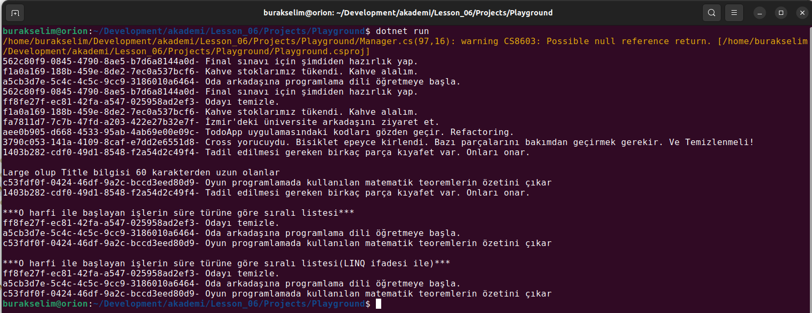

# Lesson_06 : LINQ Metotlarının İç Dinamiklerini Anlamak

Genellikle belli bir domain için yazılmış olan dillere verilebilecek en güzel örnek SQL _(Structured Query Language)_ dilidir. SQL ile veri tabanlarında tutulan veriyi ingilizce diline son derece yakın cümeleler kurarak sorgulayabiliriz. Örneğin,

```sql
Select Id,Title,Status,Priority,Duration,Size from WorkItem 
where DurationType = 'Hour'
order by Duration,Size
```

bu cümle ile WorkItem tablosunda yer alan kayıtlardan saatlik olanları ilk önce süre sonrada işin büyüklüğüne göre sıralatarak listeletmekteyiz. Bu kolay yazım ifadesi çoğu zaman nesne yönelimli dillerde de arandı. C# tarafında buna benzer cümleleri LINQ desteklemekte ancak LINQ'in arkasında yatan dünyada çok önemli unsurlar. Bu dersteki amacımız LINQ olmadan nesne dizileri üzerinden bazı sorgulamaları nasıl yapabileceğimizi görmek, buradan hareketle çok basit anlamda temsilcilerin _(delegates)_ ne işe yaradığını anlamak, dolayısıyla LINQ'in temel yapı taşlarından olan genişletme metotlarına değinip örnek uygulamadaki problemleri LINQ sorguları ile değiştirmek olacaktır. Bu amaçla Lesson_06/Projects klasöründe yer alan Playground isimli konsol uygulaması üzerinden ilerlenecektir. Programda WorkItem türünden kobay nesneler barındıran generic bir List koleksiyonu kullanılmaktadır. Bu koleksiyon üstünde aşağıdakilere benzer sorguların yapılması planlanmıştır.

- Yüksek öncelikli işlerimizi listeyelim
- Saatlik işlerimizi listeleyelim
- Saatlik işlerimizin toplam süresini bulalım
- Önceliği normal olan işlerimizinde gün bazlı olanları listeleyelim
- Yüksek öncelikli işler için ayırdığımız sürelerin toplamını gün bazında hesap edelim
- En uzun başlıklı işimizi bulup ekrana yazdıralım

## Sözlük

- **Preprocessor Directives** *(# ile başlayan ifadeler)* : Derleme zamanına geçmeyen # işareti ile başlayan ifadelerdir. En çok kullanılanlardan birisi region , endregion dır. Kod okunurluğunu artırır ancak yine de büyük kod bloklarından kaçınmak gerekir. Aski halde Cognitive Complexity değerleri yüksek kodlar oluşabilir.
- **Delegate tipi :** Bir metodu işaret edebilen tiplerdir. Bu sayede olaylar (event) tanımlanabilir ve hatta metotlara parametre olarak fonksiyonlar taşınabilir.
- **Lambda operatör ( => ):** Delegate tipinden değişkenleri alan metot parametrelerinde sıklıkla kullanılır. Metoda parametre olarak bir kod bloğunun geçirilmesini sağlar. 
- **Overload Method :** Aynı isimli yazılmış ama parametre yapıları farklı olan metotlar için kullanılan terimdir. Farklı parametrelerle farklı isimlerde n adet metot yazmak yerine aynı isimde olup farklı parametre imzaları içeren metotlar olarak düşünülebilir.
- **Extension Method :** Var olan tipleri iç yapılarına müdahale etmeden genişletebilmemize imkan sağlar. 

## Yardımcı Linkler

- Derste gelen bir soru from ile başlayan LINQ sorgusunun SQL gibi veri tabanlarına yönlendirilip yönlendirilemeyeceği üzerine idi. Bu noktada ORM _(Object Relational Mapping)_ araçlarından ve Entity Framework' ten kısaca bahsettik. EF ile ilgili basit bir öğretiye [şu adresten](https://learn.microsoft.com/en-us/ef/core/get-started/overview/first-app?tabs=netcore-cli) bakabilirsiniz. Ayrıca daha fazla LINQ sorgusu yazmak isterseniz [bu adresten](https://learn.microsoft.com/en-us/dotnet/csharp/programming-guide/concepts/linq/standard-query-operators-overview) bilgi alabilirsiniz.

## Kullandığımız Komutlar

Ders boyunca terminalden yürüttüğümüz komutlar aşağıdaki gibidir.

```shell
# proje veya çözümü derlemek için
dotnet build

# çalıştırmak için
dotnet run
```

## Çalışma Zamanı

Programımızın son noktadaki çalışma zamanı çıktısı aşağıdaki gibidir.



## Araştırsak iyi Olur

_Dersten sonra öğrencilerin araştırması için verilen konular buraya yazılır_

## Evde Çalışmak için Atıştırmalıklar

_Meraklısına evde çalışması için verilecek örnekler buraya yazılır_

## Kazanımlar

- Temel döngü enstrümanları ile nesne dizilerini sorgulamak
- Tekrarlı kod bloklarının önüne geçmek
- Temsilci _(Delegates)_ tipini temel seviyede tanımak
- Genişletme metotlarını _(Extension Methods)_ keşfetmek
- Daha fazla LINQ sorgusu yazabilmek