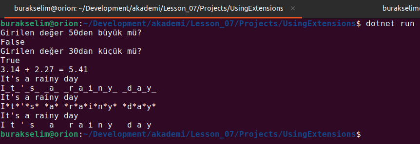
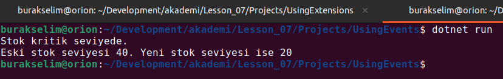

# Lesson_07 : Genişletme Metotları ve Event Kullanımı

Derste iki konuyu basit şekilde ele almaya çalıştık. Birisi önceki dersten öğrendiğimiz delegate tipinin event'ler ile kullanılması. Bir diğeri de yine LINQ sorgulama metotlarından aşina olduğumuz genişletme metotları (Extension Methods) 

Genişletmek metotları sayesinde var olan tiplerin içeriğini değiştirmeden yeni fonksiyonellikler kazanması sağlanabilir. Örneğin Int32 tipine IsLessThan, IsGreaterThan veya String türüne WriteLovely gibi normalde built-in olarak gelmeyen yeni fonksiyonellikleri, genişletme metotları ile tesis edebiliriz. Bu özellikle projelerde referans alarak kullandığımız harici kütüphanelere yeni fonksiyonellikler kazandırmak açısından da önemli bir enstrümandır.

Bu derste işlediğimiz konulardan bir diğeride delegate tipleri ile birlikte ele alınan event'ler. Nesnelere event alanları ekleyerek, belli aksiyonlar karşısından object user'ların farklı süreçleri işletmesi sağlanabilir. Örneğin stok bilgilerini tuttuğumuz bir nesne modelinde stok miktarının belli bir değerin altına inmesi bir olayla ilişkilendirilebilir. Olaylar gerçekleştiğinde, kendileri ile ilişkilendirilen delegate tiplerinin işaret ettiği türden metotların çalıştırılması söz konusu olur. Bu metotlar nesne olayın abone olan enstrümanlar tarafından kullanılır.

## Yardımcı Linkler

- [C# 3.0: Derinlemesine Extension Method Kavramı](https://www.buraksenyurt.com/post/C-3-0-Derinlemesine-Extension-Method-Kavramc4b1-bsenyurt-com-dan)
- [Çerezlik Algoritmalar ve Extension Methodlar](https://www.buraksenyurt.com/post/Cerezlik-Algoritmalar-ve-Extension-Methodlar)
- [Temsilciler (Delegates) Kavramına Giriş](https://www.buraksenyurt.com/post/Temsilciler-(Delegates)-Kavram%C4%B1na-Giris-bsenyurt-com-dan)
- [C# Temelleri - Olayları(Events) Kavramak](https://www.buraksenyurt.com/post/C-Temelleri-Olaylar%C4%B1(Events)-Kavramak-bsenyurt-com-dan)

## Kullandığımız Komutlar

Ders boyunca terminalden yürüttüğümüz komutlar aşağıdaki gibidir.

```shell
# proje veya çözümü derlemek için
dotnet build

# çalıştırmak için
dotnet run
```

## Çalışma Zamanı

UsingExtensions ve UsingEvents isimli programlara ait çalışma zamanı görüntüleri aşağıdaki gibidir.





## Evde Çalışmak için Atıştırmalıklar

Bu dersteki fonksiyonları test etmek amacıyla bir birim test projesi oluşturup üzerinde farklı kabul kriterlerini deneyebiliriz.

## Kazanımlar

- Nesnelere event bildirimleri ile yeni işlevsellikler kazandırmak
- Var olan tiplerin içeriğini değiştirmeden genişletme metotları ile zenginleştirebilmek