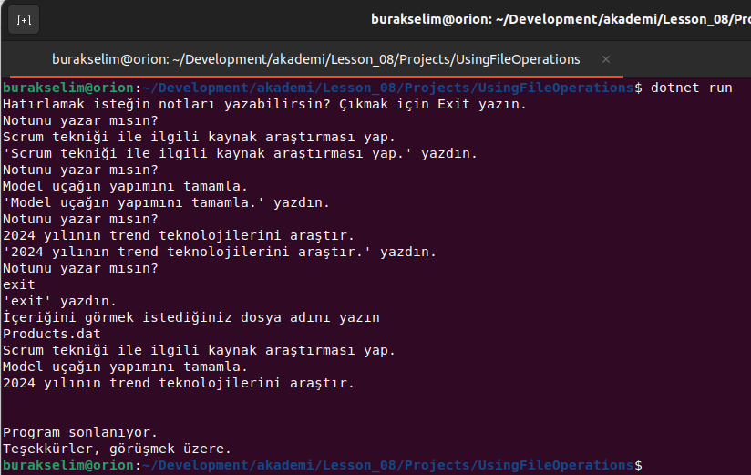
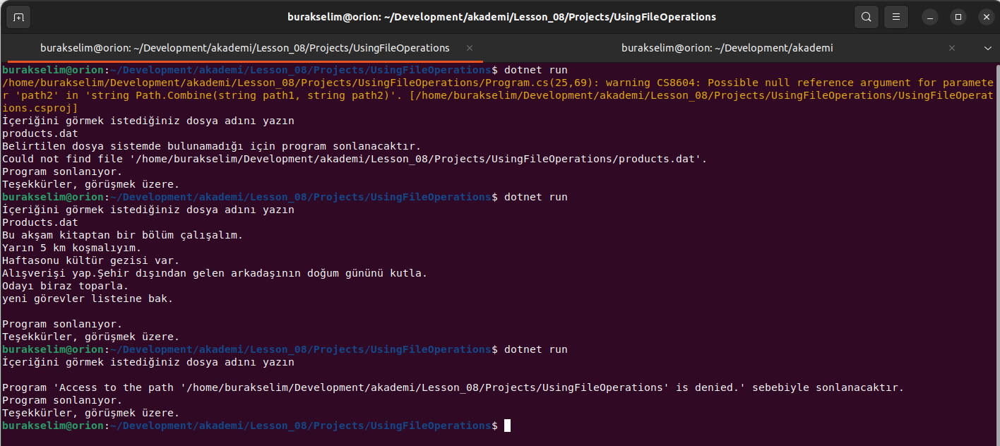

# Lesson_08 : Temel Dosya Yazma/Okuma İşlemleri ve Exception Handling

Eğitim dönemi boyunca ele aldığımız Kanban uygulaması, görev bilgilerini **in-memory** tutacak şekilde tasarlandı. Dolayısıyla program sonlandığında bu veriler kayboluyor. Programda kullanılan görev verilerini fiziki olarak saklamak için farklı çözümler söz konusu. Veritabanı kullanımı bunlar arasında en yaygın olanlarındadır. Diğer yandan basit ve çok fazla yer işgal etmeyen veri setleri fiziki dosyalarda da saklanabilir. Kanban uygulaması için bu metin tabanlı basit bir dosya olabilir. Ancak ilerleyen zamanlarda bu veri setini **JSON** formatında ya da **Binary** formatta serileştirerek tutmanın yollarını da göreceğiz. 

Bu dersteki amacımız ise temel dosyalama işlemlerine giriş yapmak ve Kanban Board uygulamasındaki Task nesne dizilerini fiziki diskte nasıl saklayabileceğimize dair bir altyapı hazırlamaktır. Örnek projemizde **FileStream**, **StreamWriter** ve **StreamReader** nesneleri kullanılarak bir dosyaya sıralı text ifadesi yazma ve okuma işlemleri ele alınmıştır. Ayrıca bu tip işlemlerde programın çökmesine neden olabilecek istisnaları ele almak için **try...catch...finally** bloklarından nasıl yararlanılabileceği de işlenmiştir.

## Sözlük

- **params** anahtar kelimesi ile bir metoda n sayıda parametre gönderebiliriz. **Console** sınıfının static **WriteLine** metodu bunun en güzel örneklerindendir.
- **using** bloğu: **IDisposable** arayüzünü _(interface)_ uyarlayan tipler **Dipose** metodunu da override ederler. Genellikle sistem kaynakları kullanan nesneler bellekten atılırken **Dispose** bloklarında ilgili kaynak iade işlemleri de yapılır. **using** bloğu ile kullanılan nesne örneklerinde, blok sonuna gelindiğinde Dispose metotları otomatik olarak çağrılır. **FileStream**, **StreamWriter** gibi derste işlediğimiz sınıflar **IDisposable** arayüzünü uygulayan örneklerdendir. Dolayısıyla using bloğu ile birlikte kullanılabilirler.
- **exception ve stack trace** : Bir exception oluştuğunda geliştirici için **Stack Trace**'de önemli bilgiler yer alır. **Stack Trace** aşağıdan yukarı doğru okunur ve hangi metottan hangi metodun çağırıldığı, hangi satıra gelindiği okunabilir. **Trace**'in en tepe noktası **Exception**'ının fırlatıldığı yerdir. 
- DotNet çatısında birçok Exception tipi bulunur. Son eki **Exception** kelimesi ile biten tipler _(FileNotFoundException, NullReferenceException, ArgumentException, IndexOutOfRangeException vb)_ catch bloklarında yakalanabilen tiplerdir. Ayrıca tüm Exception türleri **Exception** sınıfından türer. Dolayısıyla kendi Exception sınıflarımızı da var olan Exception türlerinden türeterek _(inherit)_ tasarlayabiliriz. Exception nesneleri catch bloklarında yakalanır. try...catch bloklarında bazı durumlarda **finally** bloğu da yer alır. finally blokları try bloğunda exception olsa da olmasa da çalışan bloklardır.

## Yardımcı Linkler

- [Kendi İstina Nesnelerimizi Kullanmak (ApplicationException)](https://www.buraksenyurt.com/post/Kendi-Istina-Nesnelerimizi-Kullanmak-(ApplicationException)-bsenyurt-com-dan)
- [Using İfadesi ile Garanti Dispose](https://www.buraksenyurt.com/post/Using-Ifadesi-ile-Garanti-Dispose)
- 

## Kullandığımız Komutlar

Ders boyunca terminalden yürüttüğümüz komutlar aşağıdaki gibidir.

```shell
# Örnek projeyi açmak için
dotnet new console --use-program-main -o UsingFileOperations

# Örnek projeyi solution'a eklemek için
dotnet sln add Lesson_08/Projects/UsingFileOperations/

# proje veya çözümü derlemek için
dotnet build

# çalıştırmak için
dotnet run
```

## Çalışma Zamanı

Programa ait çalışma zamanı çıktıları aşağıdaki gibidir.





## Araştırsak iyi Olur

- **FileStream** dışında söz konusu olan **NetworkStream**, **MemoryStream** gibi sınıflar hangi senaryolarda kullanılır bakabiliriz.
- **UsingFileOperations** isimli örneğimizde **FileNotFoundException** durumunu da ele aldık. Buna gerek kalmadan dosyanın sistemde var olup olmadığını denetleyip ilerleyebiliriz de. Bunu nasıl yapabileceğimizi araştıralım.

## Evde Çalışmak için Atıştırmalıklar

- Okuduğunuz kitapların listesini **text** tabanlı bir dosyaya yazan ve okuyan bir program geliştirmeyi deneyebilirsiniz. Burada öğrenilenleri pekiştirmek adına şöyle ilerlenebilir. Kitaplara ait bilgileri tutmak için bir sınıf tasarlanabilir. Örneğin kitabın adı, sayfa sayısı, yazarı veya yazarlar, kategorisi, yayın evi, yayın tarihi gibi bilgiler veri modelinde yer alabilir. Bu tip bir içeriği dosyada satır olarak nasıl saklayacağınızı da düşünmelisiniz. Kitabın bilgileri arasına virgül, noktalı virgül, ya da | gibi işaretler koyarak satır formatını tasarlayabilirsiniz. Kitap bilgilerini girmek için terminalde yine sonsuz bir döngü kullanılabilir. Kitap bilgilerini yine bir **StringBuilder** ile toparlayıp son aşamada fiziki dosyaya yazmak da düşünülebilir. Burada kitap bilgisinin karşılığı olan satırı oluşturmak için **ToString** metodunu **Book** sınıfı içinde **override** etmeyi düşünebilirsiniz. Daha önceden bir örneğini yapmıştık.
- Bir diğer örnekte dosyalar arası veri taşıma operasyonunu ele alabilirsiniz. **Products.txt** isimli dosyada duran ürün bilgilerini **Products.bin** dosyasına ASCII tablosundaki sayısal değerlerini kullanarak yazmayı deneyebilirsiniz. Örneğin A için 65, a için 97 olacak şekilde. Burada kaynak dosyadan okuma yaparken hedef dosyaya da veriyi farklı bir formata dönüştürerek yazma operasyonu ele alınmaktadır. ASCII tablosu için [şu kaynaktan](https://www.rapidtables.com/code/text/ascii-table.html) yararlanabilirsiniz.

## Kazanımlar

- Temel dosyalama işlemleri. **FileStream**, **StreamWriter** ve **StreamReader** ile dosyaya yazma ve dosyadan okuma işlemleri.
- Basit anlamda istisna yönetimi *(Exception Handling)*
- **using** bloklarının kullanımı ve amacı.
- **StringBuilder** kullanarak metin katarları oluşturmak.