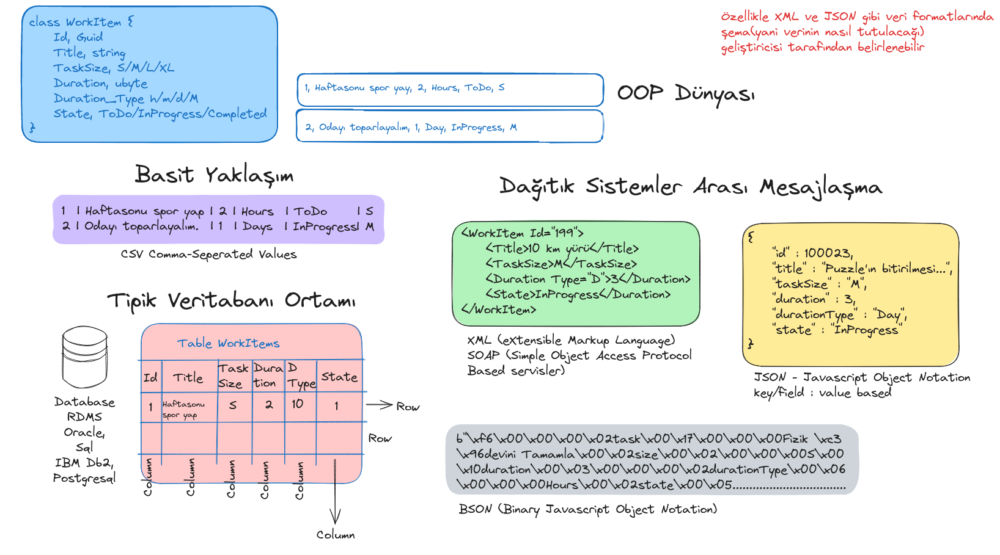

# Lesson_09 : Nesne Verilerini Depolama Biçimleri ve Koleksiyonların Fiziki Ortama Yazılıp/Okunması

Programlarda kullanılan ve bellekte tutulan nesne verileri çalışma zamanı sonlandığında doğal olarak kaybolurlar. Pek çok uygulama üzerinde çalışılan verilerin son hallerini tutabilmek için fiziki depolama ortamlarını kullanırlar. Kalıcı olarak saklanabilen bu verilerin aynı çalışma zamanı dışında özellikle dağıtık sistemlerin farklı çalışma zamanlarınca kullanılması gerektiği durumlar da söz konusu olabilir. Bu gibi durumlarda çeşitli türden veritabanı sistemleri kullanılır. _(Özellikle RDBMS-Relational Database Management Systems veya NoSQL)_

Ancak çok büyük boyutlu verilerin depolanmasında tek alternatif bu tip çözümler de değildir. Verinin dosya sisteminde farklı formatlarda tutulması da oldukça yaygındır. Ne var ki bu tip çözümlerde çok kullanıcılı çalışma ve dağıtık sistemlerde verinin paylaşılması gibi avantajlar kaybedilebilir. Hele ki verinin herkes için tutarlılığı ön planda ise. Tabii basit ihtiyaçlar için basit çözümler de pekala işe yarar.

Bu dersteki amaçlarımızdan birisi Kanban tahtamızdaki verileri bellekte tutan generic koleksiyon içeriğini dosya sistemine yazmak ve yine bu dosya sisteminden okuyarak kullanabilmektir. Bu amaçla .Net'in işleri kolaylaştıran sınıflarını kullanarak veriyi bir dosya sistemine farklı formatlarda nasıl yazabileceğimizi inceleyerek işe başlayacağız. Bir diğer amacımız da yazma/okuma işlemlerini üstlenen bileşenlerin artmasının ortaya çıkaracağı kod kirliliğini görmek ve bunun önüne geçmek için bağımlılıkları nasıl tersine çevirebileceğimizi anlamaktır. Bu ihtiyaçlar nesne yönelimli dil paradigmasının önemli öğelerinden olan interface türü ile nesne sözleşmelerinin hazırlanması ve nasıl kullanılıp ne gibi problemleri çözdüğünün anlaşılması açısından da bize bir zemin hazırlamaktadır.

İster dosya sistemi olsun, ister dağıtık sistemlerdeki uzak metot çağrıları olsun ya da makineler arasındaki haberleşme olsun verinin farklı formatlarda ele alınması mümkündür. Bunlardan bazıları aşağıdaki grafikte görüldüğü gibidir ve ders sırasında genel özelliklerinden bahsedilmiştir.



## Sözlük

- Çeşitli veri formatı türlerinden bahsettik. XML _(eXtensible Markup Language)_, JSON _(Javascript Object Notation)_, BSON _(Binary Javascript Object Notation)_ , CSV _(Comma-Seperated Values)_
- RDBMS _(Relational Database Management Systems)_
- Message Exchange Patterns
- SOLID İlkelerinden Depedency Inversion'ın sadece kulağı çınlatıldı.

## Yardımcı Linkler

- Dependency Injection ile ilgili olarak [şu yazıya](https://medium.com/dogustech/asp-net-core-dependency-injection-t%C3%BCrleri-ad1e498b077) bakılabilir

## Kullandığımız Komutlar

Ders boyunca terminalden yürüttüğümüz komutlar aşağıdaki gibidir.

```shell
# proje veya çözümü derlemek için
dotnet build

# testleri koşturmak için
dotnet test

# çalıştırmak için
dotnet run
```

## Çalışma Zamanı

Bu derste birim testler çalıştırılmıştır.

## Araştırsak iyi Olur

- SOLID ilkeleri nedir, hangi amaçlarla kullanılır.
- Özellikle Dependency Inversion prensibi hangi problemleri çözümler.

## Evde Çalışmak için Atıştırmalıklar

- Bir nesne koleksiyonunu JSON formatında bir dosyaya dönüştürmek oldukça kolaydır. Bunun için aşağıdakine benzer bir kod parçası örnek alınabilir. source aslında herhangi bir nesnedir. Dolayısıyla WorkItemManager sınıfımızın kullandığı generic listede olabilir. WorkItemManager sınıfındaki Save metodunu JSON formatta kayıt yapacak şekilde değiştirmeyi deneyebilirsiniz.

```csharp
var targetPath = Path.Combine(Environment.CurrentDirectory, $"{fileName}.json");
var content = JsonSerializer.Serialize(source, new JsonSerializerOptions { WriteIndented = true });
File.WriteAllText(targetPath, content);
```

## Kazanımlar

- Table, JSON, CSV, XML gibi temel veri saklama opsiyonlarını tanımak.
- CSV _(Comma-Seperated values)_ türünden dosya yazma, okuma işlemleri.
- Verileri JSON formatında serileştirmek, serileşmiş JSON verilerini okumak. _(Yetiştiremedik. Sonraki ders bakılacak)_

## Sonraki Derse Kadar Düşünmemiz Gerekenler

- Kanban.Data projesinde yer alan WorkItemManager sınıfının Save ve Load metotların bir bakalım. Save metodu şu anda sadece CSV formatından çıktı üretmekte. JSON, BSON, XML gibi formatlara da destek vermesi için metodun içerisinde birden fazla if eklenebilir. Ancak bu metod boyunun uzamasına, kodun okunurluğunun ve bakımının zorlaşmasına, test edilmesinin güçleşmesine sebebiyet verecektir. Bir taktik olarak if blokları içerisindeki işler farklı sınıflar içerisine taşınabilir. Bu, metot içindeki kod kalabalığını da engeller, okumayı ve test edilebilirliği kolaylaştırır. Yine de ortada bir sorun var; Kanban.Data geliştirdiğimiz Framework'ün bir parçasıdır ve son kullanıcının referans edip çalıştırabileceği bir pakettir. Kullanıcının dosya içerisinde tutması istenen farklı bir format olduğunda WorkItemManager sınıfındaki Save metodunu yine değiştirmemiz ve doğlar olarak son kullanıcılara tekrardan dağıtmamız gerekir. İşte bu sıkı bağlılığı gevşetmenin bir yolu olmalıdır. Save metodunu öyle bir tasarlamalıyız ki hangi formatta yazacağı gibi bilgileri bilmesine gerek kalması ;) Bu düşünce bizi Dependency Inversion prensibine ve Interface kullanımına götürecektir. Düşünmeniz gereken sorunu iyice anlamaktan ibaret.
- Bir diğer handikapımız ise Save ve Load metotlarının dönüş türleridir. Save metodu sadece true , false döndürmekte, Load metodu ise private olarak sadece WorkItemManager yapıcısında kullanılmaktadır. Bir dosyanın başarılı şekilde kaydedilmesi haricinde başarısız olma durumunda ne gibi bir istisnanın oluştuğu son kullanıcıya bildirilmelidir. Dolayısıyla Save metodundan geriye bool döndürmek yerine daha iyi bir çözüm ne olabilir. İçinde işlem durumu, tarihi, ne yapıldığına dair bilgiler de barındıran bir mesajın doğru bir tasarımla dönmesi en idealidir. Ayrıca Load operasyonunda bir sorun olması ve exception üretilmesi sonrası kod nasıl hareket etmelidir. Sistem WorkItemManager nesne kullanıcısına bunu nasıl bildirmelidir. Bir Exception kasıtlı olarak fırlatılsa daha iyi olabilir mi? Bu konuyla ilgili olarak da bu soruyu düşünmeniz beklenmektedir.
- Birim test metotları bu ders itibariyle fiziki Board.csv dosyasına bağımlı hale gelmiştir. Ancak bu paket başka bir sisteme indiğinde söz konusu dosya olmayabilir, içeriği beklenen şekilde dolu olmayabilir. Bu durum nasıl çözümlenebilir? Sanki test projesinin çalışma zamanında Board.csv varmış gibi hareket edilmesi sağlanabilir mi? Sadece sorunu anlamaya çalışalım.
