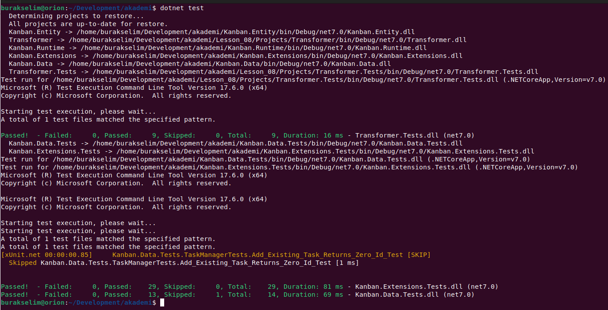

# Lesson_10 : Interface Kavramına Giriş ve Nesne Bağımlılıklarının Çözümlenmesi

Bir önceki dersimizde Kanban borduna eklenen içeriklerin fiziki dosyaya **Comma-Separated Values (CSV)** formatında yazılması için bir takım çalışmalar yapmıştık. Bu çalışmalar sırasında eklediğimiz kaydetme ve okuma metodları birim test projesindeki bazı testlerin Failed olarak hatalı sonlanmasına sebebiyet vermektedir. Hatta bu reponun olduğu pipeline hattında çalışan işler test aşamasındaki hatalar nedeniyle patlamaktadır. Gerçek hayat senaryolarında **CI** _(Continuous Integration)_ hattına kurulan bu tip mekanizmalar patladığında ürünün yeni sürümü de son kullanıcıyla buluşmayacak ve istenmeyen sonuçlar ortaya çıkacaktır. Bu repo için örnek bir ekran görüntüsü aşağıdaki paylaşılmıştır. Testler patladığı sürece hiçbir değişiklik üretim hattına gönderilmez ve solution gerekli kabul kriterlerini sağlamaz.


Bu dersteki amacımız söz konusu hatalara neden olan problemi görmek, bu probleme ait nesne bağımlılığını çözmek için de **Interface** türünü tanımaktır. Özellikle nesne yönelimli dillerin temel prensiplerinden olan kalıtım _(Inhertiance)_ ve çok biçimlilik _(Polymorphism)_ ilkelerinin C# tarafında uygulanmasında da önemli bir role sahip olan Interface türü nesne bağımlılıklarını tersine çevirerek **loosely-coupled** kullanımların tesis edilmesinde de kullanılmaktadır. Bu sayede birim testlerin çalışması için gereken birçok bağımlılık kolaylıkla mock'lanabilir hale gelmektedir. Interface türlerinin kullanımı sadece OOP açısından değil, test edilebilirlik, yüksek kalitede kod, plug-in tabanlı ürünler geliştirilmesi açısından da önemlidir. Dersteki ana hedefimiz özellikle **Load** metodundaki **ReadAllLines** ile oluşan kaynak bağımlılığını metot dışına almak üzerine olacaktır.

Ders planındaki ikinci amacımız da yazma operasyonlarını format bağımsız hale getirebilmektir. **Save** metodu ilk etapta sadece **CSV** formatında çıktı üretmek üzere tasarlanmıştır. Ancak verinin **JSON** veya **XML** gibi farklı formatlarda kaydedilmesi de söz konusu olabilir. Hatta **object user** bu formata kendisi de karar verebilmeli bunu yaparken **Save** metodunun içeriğini değiştirmesine gerek kalmamalıdır. Dolayısıyla hem yazma formatı hem de yazma işleminin gerçekleştirileceği hedef ortam **TaskManager** sınıfına dışarıdan verilebilmelidir. Tahmin edileceği üzere burada işi çözmek için **Interface** türünden yararlanılacak ve asıl işi yapan yazma operatörlerinin nesneye parametre olarak enjekte edilmesine odaklanılacaktır. Bu da dependency inversion prensibinin bir nevi uygulanış biçimidir.

## Sözlük

- Constructor Injection ;
- Mocking ;
- Moq kütüphanesi ;

## Yardımcı Linkler

- [Asp.Net Core - Dependency Injection Türleri](https://www.buraksenyurt.com/post/asp-net-core-dependency-injection-turleri)

## Kullandığımız Komutlar

Ders boyunca terminalden yürüttüğümüz komutlar aşağıdaki gibidir.

```shell
# proje veya çözümü derlemek için
dotnet build

# projedeki testleri koşturmak için
dotnet test

# çalıştırmak için
dotnet run

# test projesinde mock kütüphanesi olarak Moq paketinden yararlandık
# test projesine yüklemek için
dotnet add package Moq
```

## Çalışma Zamanı

Load metodunu Dependency Injection ile dışarıya aldıktan sonra testler başarılı bir şekilde tamamlanabilmiştir. Son olarak Mock nesneler kullanılmıştır. Testlere ait örnek bir çalışma zamanı görüntüsü aşağıdaki gibidir.



Ders sırasında yetiştiremediğimiz ancak Interface kullanımına ait bir diğer örneğin çalışma zamanı çıktısı ise aşağıdaki gibidir. Bu örnekte oyuncu bilgilerini tutan bir listenin toplam puana göre az düşükten yükseğe ve tam tersi şekilde sıralanabilmesi için Sort metoduna kendi IComparer uyarlamamızın nasıl entegre edilebileceği incelenmektedir. Sort, koleksiyonların bir metodudur ve versiyonlarından birisi aşağıdaki gibidir.

```csharp
public void Sort(IComparer<T>? comparer);
```

Dikkat edileceği üzere metod IComparer arayüzünü almaktadır. Bu arayüz kendisini uyarlayan sınıfların tek bir metodu yazmasını bekler. O da Compare fonksiyonudur. Bu metod genelde parametre olarak gelen türlerin primitive tipe indirgenebilen özelliklerine göre 0,1 veya -1 döndürecek şekilde programlanır. Buna göre iki nesnenin birbirlerinden büyük, küçük veya eşit olma halleri hesaplanır. Bu hesaplamayı kullanan taraf ise çalışma zamanındaki Sort metodudur. Böylece kendi türlerimiz .Net'in Sort metodunun kodunu değiştirmeye gerek kalmadan sıralama kriterlerimizi çalışma zamanına öğretebiliriz.


## Araştırsak iyi Olur

- Birim testlerde _(Unit Tests)_ nesnelerin mocklanması ile ilgili kaynaklara bakılabilir.
- Interface tipinin buradaki kullanım alanı dışındaki kullanımlarına bakılabilir.

## Evde Çalışmak için Atıştırmalıklar

- Task Manager sınıfındaki bazı fonksiyonlarda try...catch blokları kullanılmaktadır. Exception Handling konusunun önemli mevzularından birisi de bu hata bilgilerinin kullanılabilir şekilde kayıt altına alınmasıdır. Loglama işleminin amaçlarından birisi de budur. İstenirse bununla ilgili bir antrenman yapılabilir. .Net Platformunun kendi dahili loglama mekanizması da vardır ancak kendi loglama mekanizmamızı da TaskManager sınıfına entegre etmeyi deneyebiliriz. Burada önemli olan nokta TaskManager sınıfına asıl loglama işlerini yapan nesnelerin değil, bu nesneler için bir sözleşme _(contract)_ sunan arayüz _(interface)_ referanslarının geçilmesi gerektiğidir. Böylece TaskManager sınıfı loglama stratejisini uygulayan herhangi bir gerçek nesne örneği ile çalışabilir. Geliştiricinin TaskManager sınıfının kodunu değiştirmesine gerek kalmaz sadece istenen loglayıcı nesne örneği çalışma zamanında bu nesneye enjekte edilir ve kullanımına sunulur.
- CsvLoader, CsvSaver sınıflarına ait fonksiyonellikler ITaskDataContext türevli farklı bir bir sınıf içerisinde birleştirilebilir ve test projesinde bu arayüz mocklanabilir.

## Kazanımlar

- Nesne bağımlılıklarını çözümlemek için interface türünden yararlanılması.
- Interface türü ile çok biçimlilik ilkesinin uygulanması.
- Birim testlerde fake nesneler kullanılması ve Moq paketi ile çalışmak.
  