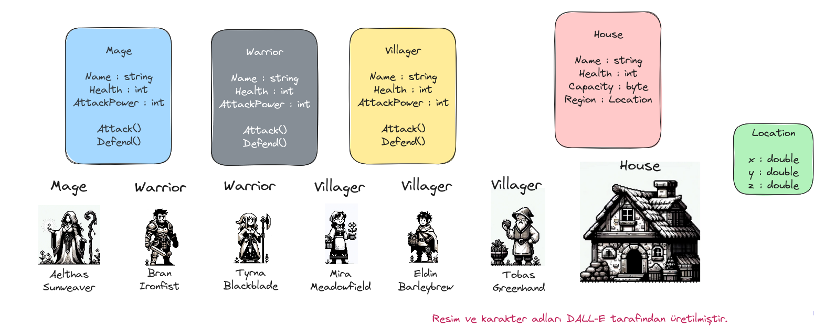
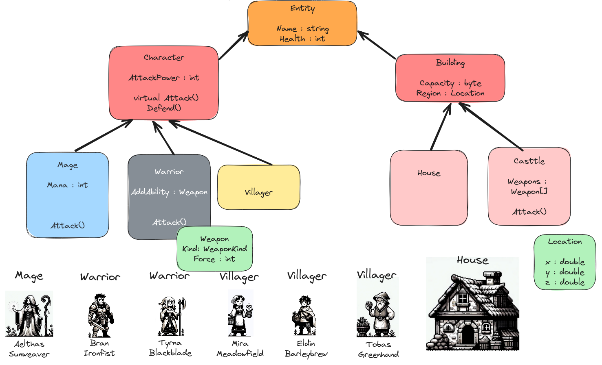

# Lesson_11 : Kalıtım Kavramı ve Örnek Üzerinden İncelenmesi

Bu dersteki amacımız nesne yönelimli dillerin önemli bir özelliği olan kalıtım konusunu kısaca tanımak. Esasında bundan önceki derslerimizde Interface konusunu işlerken ve nesne bağımlılıklarını çözümlerken kalıtımın uyarlanma modellerinden birisini işledik. Hatta herkesin bir Object olduğu teorisinden yola çıkarken ToString metodunun ezildiği _(override)_ edildiği noktalarda da kalıtıma atıfta bulunduk. Elbette bu konuyu anlamanın en iyi yolu bir örnek üzerinden ilerlemekle mümkün olacaktır. Bu dersimizde bir oyun platformundaki karakterler üzerinde kalıtım _(inheritance)_ tekniklerini kullanarak nasıl modelleme yapabileceğimizi incelemeye çalışacağız.

Konu anlatımımıza bir oyun içerisindeki karakterleri veya yapıları düşünerek başladık.



Burada oyun karakterleri ve binalara ilişkin çok basit bir analiz yer almakta. Bazı özellikler ve fonksiyonlar üst sınıflarda toplanabilir, bazı davranışlar ortaklaşa kullanılıp istenirse alt sınıflarda tekrarda yazılabilirler. Mage, Warrior ve Villager birer Character nesnesidir. House ve Casttle ise birer Building nesnesidir. Ayrıca Building ve Character birer Entity nesnesidir. Bu şekilde yaptığımı kalıtım kurgusu elbette farklılıklar gösterebilir.




## Sözlük

- **Sanal Metotlar _(Virtual Methods)_ :** .Net içerisindeki herkes Object sınıfından türer. Object sınıfı içerisinde virtual olarak tanımlanmış bazı metotlar vardır. ToString, GetHashCode gibi. Bunlar varsayılan birer davranışa sahiptir ama istenirse kendi türlerimizde ezilebilirler. Aynı prensip kendi türetmelerimizde de söz konusudur.

## Yardımcı Linkler

_Ders sırasında uğradığımız sayfalar varsa linkleri paylaşılır_

## Kullandığımız Komutlar

Ders boyunca terminalden yürüttüğümüz komutlar aşağıdaki gibidir.

```shell
# Örneğimizi aşağıdaki gibi oluşturabiliriz
dotnet new console --use-program-main -o InheritanceLab

# proje veya çözümü derlemek için
dotnet build

# projedeki testleri koşturmak için
dotnet test

# çalıştırmak için
dotnet run
```

## Çalışma Zamanı

_Derste işlenen kodların çıktısı eklenir_

## Araştırsak iyi Olur

_Dersten sonra öğrencilerin araştırması için verilen konular buraya yazılır_

## Evde Çalışmak için Atıştırmalıklar

- Kanban board uygulamasında henüz sadece bir varlık nesnesi _(Entity)_ kullanıyor ki onu Task olarak isimlendirmiştik. Bunun dışında Task öğeleri ile ortak özellikler barındırabilecek başka nesneler söz konusu olur mu araştırılabilir. Örneğin tahtanın üzerindeki WorkItem'ların dahil olduğu bir proje ya da çalışma alanı _(workspace)_ tasarıma eklenip kalıtım içerisinde kullanılabilir mi araştırılabilir. Burada nesnelerin ortak özelliklerini ve davranışlarını tespit etmek, üst sınıfta bunları tanımlamak ve türeyen sınıflarda _(alt sınıflarda)_ istenenleri özelleştirebilmek _(override)_ bazılarını ise mecburi olarak uygulatmaya zorlamak gibi unsurların tespiti önemlidir. Kanban uygulaması özelinde düşündüğümüzde görev sahibi, proje, görevin dahil olduğu grup, görevle ilişkili tag bilgileri birer nesne olarak sisteme dahil edilebilirler.

## Kazanımlar

- Nesneler arası ilişkilerde kalıtım _(Inheritance)_ kullanımı.
- Üst sınıf metotlarının sanallaştırılması.
- Alt sınıflarda ortak metot davranışlarının özelleştirilmesi.
- Abstract sınıf kullanımı
  