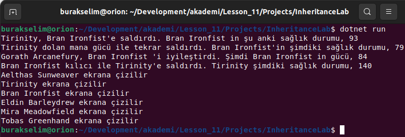

# Lesson_11 : Kalıtım Kavramı ve Örnek Üzerinden İncelenmesi

Bu dersteki amacımız nesne yönelimli dillerin önemli bir özelliği olan **kalıtım _(inheritance)_** konusunu kısaca tanımak. Esasında bundan önceki derslerimizde **Interface** konusunu işlerken ve nesne bağımlılıklarını çözümlerken kalıtımın uyarlanma modellerinden birisini de işledik. Hatta herkesin bir **Object** olduğu teorisinden yola çıkarken **ToString** metodunun ezildiği _(override)_ edildiği noktalarda da kalıtıma atıfta bulunduk. Elbette bu konuyu anlamanın en iyi yolu bir örnek üzerinden ilerlemekle mümkün. Bu dersimizde bir oyun platformundaki karakterler üzerinde **kalıtım _(inheritance)_** tekniklerini kullanarak nasıl modelleme yapabileceğimizi incelemeye çalışacağız.

Konu anlatımımıza bir oyun içerisindeki karakterleri veya yapıları aşağıdaki şekildeki gibi düşünerek başladık.


Bu görselde oyun karakterleri ve binalara ilişkin çok basit bir analiz yer almakta. Bazı özellikler ve fonksiyonlar üst sınıflarda toplanabilir, bazı davranışlar ortaklaşa kullanılıp istenirse alt sınıflarda tekrardan yazılabilirler. Mage, Warrior ve Villager birer Character nesnesidir. Aralarında is a ilişkisi vardır _(Mage is a Character ya da Warrior is a Character gibi)_ House ve Castle ise birer Building nesnesidir. Ayrıca Building ve Character birer Entity nesnesidir. Bu şekilde yaptığımız kalıtım kurgusu elbette değiştirilebilir ancak temel ilkeler nezninde aşağıdaki gibi bir yapı ele alınmıştır.


## Sözlük

- **base :** base anahtar kelimesi türetme hiyerarşisinde hep bir üst sınıfı işaret etmekdir. base ile üst yapıcılara, metotlara, property'lere gidilebilir.
- **protected :** Sadece türeyen sınıflar tarafından erişilmesini istediğimiz üyeler için kullanılan erişim belirleyicisidir _(Access Modifier)_
- **Sanal Metotlar _(Virtual Methods)_ :** .Net içerisindeki herkes Object sınıfından türer. Object sınıfı içerisinde virtual olarak tanımlanmış bazı metotlar vardır. ToString, GetHashCode gibi. Bunlar varsayılan birer davranışa sahiptir ama istenirse kendi türlerimizde ezilebilirler. Aynı prensip kendi türetmelerimizde de söz konusudur.
- **Abstract sınıflar :** Normal sınıflar gibi üyeler içerebilen, doğrudan new operatörü ile örneklenemeyen ve türeyen sınıfların mutlaka uygulaması gereken üyeleri içeren sınıflardır.
- **Çoklu Kalıtım (Multi Inheritance) :** Bir sınıfın birden fazla sınıftan türetilmesi C# tarafında mümkün değildir. Ancak çoklu kalıtım interface'ler üzerinden sağlanabilir. Yani bir sınıfa birden fazla interface implemente edilebilir. Bunun canlı bir örneği için generic List sınıfının .net içerisindeki tanımına bakılabilir.

```csharp
public class List<T> : ICollection<T>, IEnumerable<T>, IEnumerable, IList<T>, IReadOnlyCollection<T>, IReadOnlyList<T>, ICollection, IList
```

## Kullandığımız Komutlar

Ders boyunca terminalden yürüttüğümüz komutlar aşağıdaki gibidir.

```shell
# Örneğimizi aşağıdaki gibi oluşturabiliriz
dotnet new console --use-program-main -o InheritanceLab

# proje veya çözümü derlemek için
dotnet build

# projedeki testleri koşturmak için
dotnet test

# çalıştırmak için
dotnet run
```

## Çalışma Zamanı

Programın örnek bir çalışma zamanı çıktısı aşağıdaki gibidir.



## Araştırsak iyi Olur

- **Access Modifer _(Erişim Belirleyicileri)_ :** Hangi erişim belirleyicisi hangi senaryolarda ele alınır araştırabiliriz.

## Evde Çalışmak için Atıştırmalıklar

- Kanban board uygulamasında henüz sadece bir varlık nesnesi _(Entity)_ kullanıyor ki onu WorkItem olarak isimlendirmiştik. Bunun dışında WorkItem öğeleri ile ortak özellikler barındırabilecek başka nesneler söz konusu olur mu araştırılabilir. Örneğin tahtanın üzerindeki WorkItem'ların dahil olduğu bir proje ya da çalışma alanı _(workspace)_ tasarıma eklenip kalıtım içerisinde kullanılabilir mi araştırılabilir. Burada nesnelerin ortak özelliklerini ve davranışlarını tespit etmek, üst sınıfta bunları tanımlamak ve türeyen sınıflarda _(alt sınıflarda)_ istenenleri özelleştirebilmek _(override)_ bazılarını ise mecburi olarak uygulatmaya zorlamak gibi unsurların tespiti önemlidir. Kanban uygulaması özelinde düşündüğümüzde görev sahibi, proje, görevin dahil olduğu grup, görevle ilişkili tag bilgileri birer nesne olarak sisteme dahil edilebilirler.
- InheritanceLab projesinde konuşlandırılmış olan türler bir sınıf kütüphanesine alınır ve bazı koşulların testi için birim test projesi açılıp kullanılır.

## Kazanımlar

- Nesneler arası ilişkilerde kalıtım _(Inheritance)_ kullanımı.
- Üst sınıf metotlarının sanallaştırılması.
- Alt sınıflarda ortak metot davranışlarının özelleştirilmesi.
- Abstract sınıf kullanımı
  