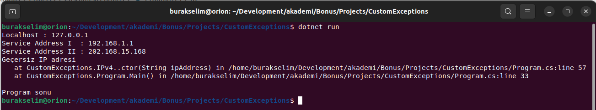
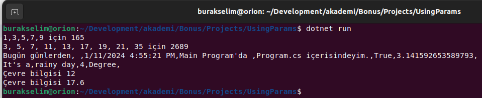
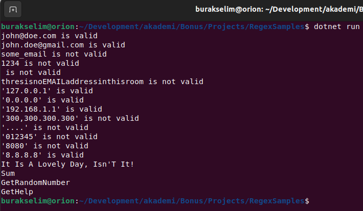
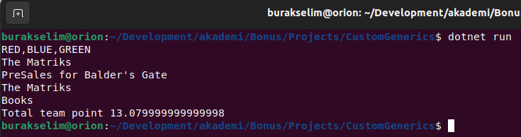
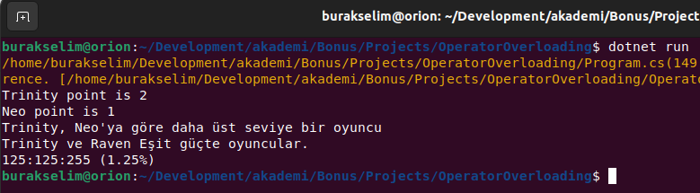
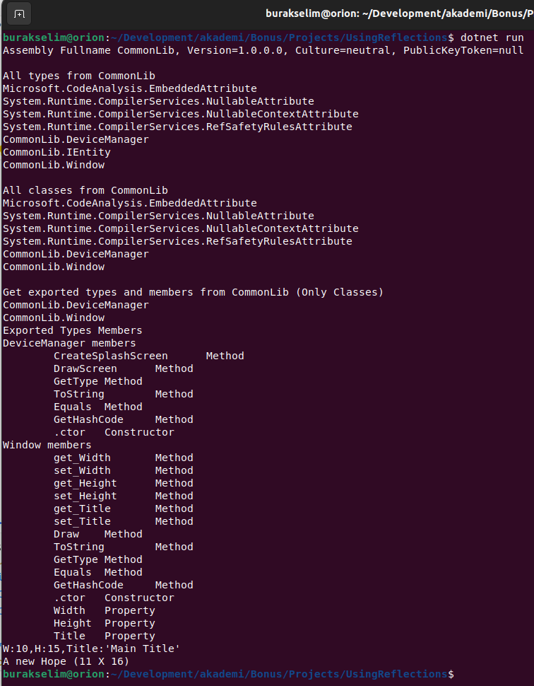
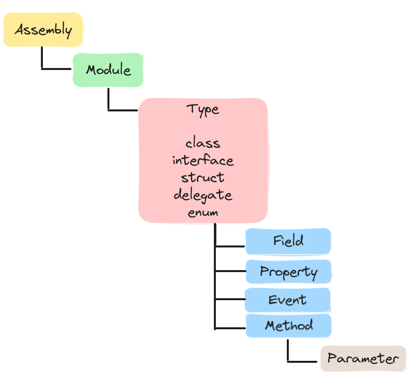
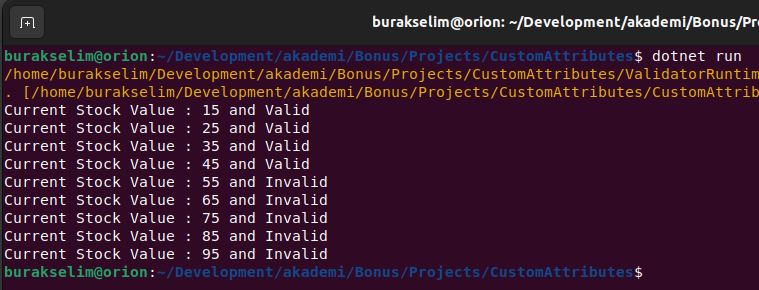

# Lesson_12 : Kendi Generic Türlerimizi, Exception ve Attribute Sınıflarımızı Yazmak

.Net tip sistemi oldukça geniştir. Framework içerisinde yayılmış hemen her ihtiyacı karşılayacak generic türler, istsina ve nitelik nesneleri bulunur. Yine de bazı hallerde kendi türlerimize ihtiyaç duyabiliriz. Örneğin bir sınıfın veya metodun farklı tipler için tekrar etmesi yerine generic bir sınıf tasarımı tercih edilebilir. Generic yapılara eklenecek kısıtlar ile _(Generic Constraints)_ tür güvenliği ve kontrolü daha yüksek seviyede sağlanabilir. Benzer şekilde kendi domain yapılarımızda var olan istisna tipleri dışında daha özel istisna tiplerine de ihtiyaç duyulabilir. Attribute kullanımı ise biraz daha ileri seviye bir konu olmakla birlikte metadata programlama kabiliyetleri açısından önem arz eder. Yine .net çerçevesinden bakıldığında sayısı Attribute sınıfı olduğunu görürüz ve elbette kendi Attribute tiplerimizi de geliştirebiliriz. Nitelikler daha çok reflection konusu ile birlikte ele alınır ve çalışma zamanına ekstra bilgi taşınması amacıyla kullanılırlar. Buna göre örneğin bir IDE'nin veya servisler host eden bir katmanın kendisine gelen tipleri çalışma zamanında nasıl yorumlaması gerektiğine dair bilgiler metadata'lar yardımıyla taşınabilir. Bu derste bu üç konu ile ilgili olarak giriş seviyesinden bilgiler verilmekte ve ileri seviye programlama açısından neler yapılabileceğine dair fikirler sunulmaktadır.

## Yardımcı Linkler

- [Reflection Sınıfı İle Tiplerin Sırrı Ortaya Çıkıyor - 2003](https://www.buraksenyurt.com/post/Reflection-S%C4%B1n%C4%B1f%C4%B1-Ile-Tiplerin-S%C4%B1rr%C4%B1-Ortaya-C%C4%B1k%C4%B1yor-bsenyurt-com-dan)
- [C# Temelleri : Nitelikleri(Attributes) Kavramak - 2007](https://www.buraksenyurt.com/post/C-Temelleri-Nitelikleri(Attributes)-Kavramak-bsenyurt-com-dan)
- [NuGet Reposu](https://www.nuget.org/packages)
- [Örnek XML Comment Kullanımları için Serilog reposu](https://github.com/serilog/serilog/blob/dev/src/Serilog/Core/Logger.cs)
- [Regex kullanımları ile ilgili bir topluluk sitesi](https://regex101.com/library)

## Kullandığımız Komutlar

Ders boyunca terminalden yürüttüğümüz komutlar aşağıdaki gibidir.

```shell
# proje veya çözümü derlemek için
dotnet build

# projedeki testleri koşturmak için
dotnet test

# çalıştırmak için
dotnet run
```

## Çalışma Zamanı

Kendi Exception türlerimizi nasıl yazdığımıza dair örneğin çalışma zamanı çıktısı.



Params anahtar kelimesinin kullanıldığı örneğe ait çalışma zamanı çıktısı.



Regex ifadelerine ait örneğin çalışma zamanı çıktısı.



Generic tür kullanımına ilişkin çalışma zamanı çıktısı.



Operator overloading konusuna ait çalışma zamanı çıktısı.



Reflection konusuna ait çalışma zamanı çıktısı.



Reflection biraz daha ileri seviye bir konu ve başlangıçta .Net tip sistemi içindeki enstrümanları iyi bilmeyi gerektiriyor. Örneklerde kullandığımız hiyerarşi yapısını aşağıdaki çizelgede görebilirsiniz. Bu kavramları bildiğimiz takdirde Reflection enstrümanlarını kullanmamız oldukça kolay olacaktır.



Attribute kullanımına ait çalışma zamanı çıktısı.



## Araştırsak iyi Olur

- .Net ile birlikte hazır gelen nitelikler _(Attribute)_ ve kullanım yerlerine bakılabilir.
- Reflection ile Plug-In tabanlı uygulamalar nasıl geliştirilir konusu araştırılabilir

## Kazanımlar

- Özel generic tip ve üyelerin yazılması, kullanım senaryoları.
- Özel istisna tiplerinin yazılması ve kullanım senaryoları.
- Reflection kavramının temelleri.
- Nitelik sınıfı geliştirmek ve kullanmak.
