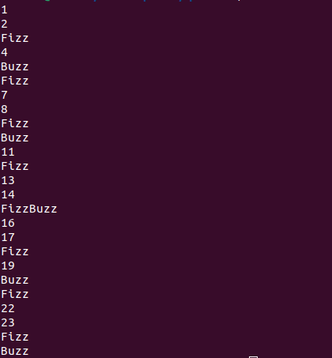
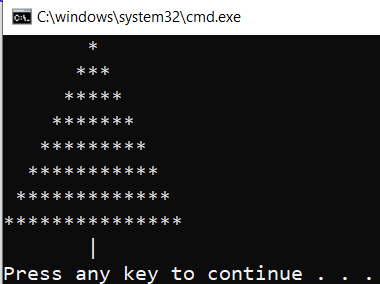
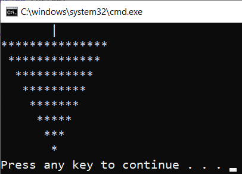

# ESOGU - C# ile Programlama - Ara Sınav - 20 Soru - 60 Dakika

### 00 - Aşağıdaki kod parçasında ... ile işaretli yere şıklardaki hangi anahtar kelime(keyword) gelmelidir?

```csharp
... averagePoint = 50.89;

Console.WriteLine($"Ortalama puan {averagePoint}");
```

- [ ] **a -** int
- [ ] **b -** string
- [ ] **c -** f32
- [ ] **d -** double

### 01 - Aşağıdaki ifadelerden hangisi doğrudur?

- [ ] **a -** C# yorumlayıcı _(interpreter)_ kullanan bir programlama dilidir.
- [ ] **b -** C# ile yazılan kodlar doğrudan makine diline çevrilir.
- [ ] **c -** Nesne yönelimli dillerin önemli karaktresitikleri soyutlama _(Abstraction)_, kapsülleme _(Encapsulation)_, kalıtım _(Inheritance)_ ve çok biçimliliktir _(Polymorphism)_.

### 02 - Main fonksiyonu içeren bir console uygulaması oluşturmak için aşağıdaki komutlardan hangisi kullanılır.

- [ ] **a -** dotnet new console --use-program-main -o hello_world
- [ ] **b -** dotnet new console -o hello_world
- [ ] **c -** dotnet create project console
- [ ] **d -** dotnet new web -o hello_world

### 03 - Aşağıdaki kod neden çalışmaz?

```csharp
namespace HelloWorld;

internal class Program
{
    static void main(string[] args)
    {
        Console.WriteLine("Hello, World!");
    }
}
```

- [ ] **a -** Program sınıfı internal erişim belirleyicisi ile tanımlanmadığı için.
- [ ] **b -** args dizisi main metodunda kullanılmadığı için.
- [ ] **c -** main metodunun adı hatalı yazıldığı için.
- [ ] **d -** main metodu geriye sonuç döndürmediği için.

### 04 - Aşağıdaki kodda ... ile boş bırakılan yerlere sırasıyla hangi anahtar kelimeler gelmelidir? _(... ifadelerini ilk kod satırından itibaren değerlendirip cevaplayınız)_

```csharp
namespace ShopApp;

internal ... Program
{
    static void Main(string[] args)
    {
        Console.WriteLine("Lütfen ürünün adını giriniz");
        var productName = Console.ReadLine();

        var currentCategory = Category.Electronic;

        Console.WriteLine("Ürünün fiyatını giriniz");
        var unitPrice = Convert.ToDecimal(Console.ReadLine());
        Console.WriteLine(..."Ürünün adı {productName}({unitPrice} TL) , Kategorisi {currentCategory}");
    }
}

... Category
{
    Electronic,
    Book,
    Game
}
```

- [ ] **a -** struct, $, enum
- [ ] **b -** class, #, enum
- [ ] **c -** class, #, struct
- [ ] **d -** class, $, enum

### 05 - Aşağıdaki programın çalışma zamanı çıktısı aşağıdaki şıklardan hangisidir?

```csharp
namespace ShopApp;

public static class Program
{
    static void Main()
    {
        var products = new Product[3];
        products[0] = new Product
        {
            Id = 1,
            Title = "Advanced C# Programming",
            Category = Category.Book,
            Price = 40.50M
        };
        products[1] = new Product
        {
            Id = 2,
            Title = "Rust Programming",
            Category = Category.Book,
            Price = 35.90M
        };
        products[2] = new Product
        {
            Id = 3,
            Title = "C# ile Programlamaya Giriş",
            Category = Category.Book,
            Price = 25.55M
        };

        for (int i = 0; i < products.Length; i++)
        {
            Console.WriteLine($"Fiyat : {products[i].Price}");
            products[i].DecreasePrice(0.5M);
            Console.WriteLine($"İndirimli fiyat : {products[i].Price}");
        }
    }
}

class Product
{
    public int Id { get; set; }
    public string Title { get; set; } = string.Empty;
    public Category Category { get; set; }
    public decimal Price { get; set; }

    public void DecreasePrice(decimal rate)
    {
        Price -= Price * rate;
    }
}

enum Category
{
    Electronic,
    Book,
    Game
}
```

- [ ] **a -** 
```text
Fiyat : 40,50
İndirimli fiyat : 20,250
Fiyat : 35,90
İndirimli fiyat : 17,950
Fiyat : 25,55
İndirimli fiyat : 12,775
```
- [ ] **b -** 
```text
Fiyat : 40.50
İndirimli fiyat : 20.250
Fiyat : 35.90
İndirimli fiyat : 17.950
Fiyat : 25.55
İndirimli fiyat : 12775
```
- [ ] **c -** Kod tip dönüştürme hatası _(Type Cast Exception)_ vererek kırılır.

- [ ] **d -** 
```text
Fiyat : 40.50

İndirimli fiyat : 20.250

Fiyat : 35.90

İndirimli fiyat : 17.950

Fiyat : 25.55

İndirimli fiyat : 12775
```

### 06 - Aşağıdaki program çalıştığında oluşabilecek olası hata aşağıdaki şıklardan hangisi olabilir?

```csharp
namespace ShopApp;

public static class Program
{
    static void Main()
    {
        var product = new Product
        {
            Id = 1,
            Title = "Filips 4K Monitor",
            Category = Category.Electronic
        };
        Console.WriteLine($"{product.Id}-{product.Title} {product.Price} $");
        Console.WriteLine("Ürün fiyatı?");
        product.Price = Convert.ToDecimal(Console.ReadLine());
        Console.WriteLine($"{product.Id}-{product.Title} {product.Price} $");
    }
}

class Product
{
    public int Id { get; set; }
    public string Title { get; set; } = string.Empty;
    public Category Category { get; set; }
    public decimal Price { get; set; }

    public void DecreasePrice(decimal rate)
    {
        Price -= Price * rate;
    }
}

enum Category
{
    Electronic,
    Book,
    Game
}
```

- [ ] **a -** Product sınıfına ait nesne örneği _(object instance)_ oluşturulurken Price bilgisi verilmediğinden program derlenmeyecek ve bu sebeple çalışmayacaktır.
- [ ] **b -** Ürün fiyatı bilgisi decimal olarak dönüştürülemeyecek bir ifade olarak girilebilir. Bu **System.FormatException** istisnasının fırlatılmasına neden olur.
- [ ] **c -** Convert.ToDecimal metoduna parametre olarak Console.ReadLine() metodu atanamaz. Bu nedenle program derleme zamanı hatası vererek sonlanır.
- [ ] **d -** Ürün fiyatı bilgisi decimal olarak dönüştürülemeyecek bir ifade olarak girilebilir. Bu **System.ArgumentException** istisnasının fırlatılmasına neden olur.

### 07 - Geriye değer döndürmeyen bir metot aşağıdaki hangi anahtar kelime ile tanımlanır.

- [ ] **a -** void
- [ ] **b -** C# dilinde tüm fonksiyonlar bir dönüş tipine sahip olmalıdır.
- [ ] **c -** null
- [ ] **d -** nothing

### 08 - Aşağıdaki programın çalışma zamanı çıktı şıklardan hangisidir ?

```csharp
using Algebra;

class Program
{
    static void Main()
    {
        for (int i = 0; i < 10; i++)
        {
            Console.Write(Fibonacci.Get(i) + ", ");
        }
    }
}

namespace Algebra
{
    public static class Fibonacci
    {
        public static int Get(int n)
        {
            if (n <= 1)
            {
                return n;
            }
            else
            {
                return Get(n - 1) + Get(n - 2);
            }
        }
    }
}
```

- [ ] **a -** 1, 1, 2, 3, 5, 8, 13, 21,
- [ ] **b -** 1, 1, 2, 3, 5, 8, 13, 21, 34,
- [ ] **c -** 0, 1, 1, 2, 3, 5, 8, 13, 21, 34,
- [ ] **d -** Program IndexOutOfRangeException vererek kırılır ve sonlanır.

### 09 - Aşağıdaki program derleme zamanında hata almaktadır. Bunun sebebi şıklardan hangisidir?

```csharp
namespace ShopApp;

public static class Program
{
    static void Main()
    {
        var products = new List<Product>(){
            new Product
            {
                Id = 1,
                Title = "Advanced C# Programming",
                Category = Category.Book,
                Price = 40.50M
            },
            new Product
            {
                Id = 2,
                Title = "Rust Programming",
                Category = Category.Book,
                Price = 35.90M
            },
            new Product
            {
                Id = 3,
                Title = "C# ile Programlamaya Giriş",
                Category = Category.Book,
                Price = 25.55M
            }
        };

        foreach (var product in products)
        {
            Console.WriteLine($"Fiyat : {product.Price}");
            product.DecreasePrice(0.5);
            Console.WriteLine($"İndirimli fiyat : {product.Price}");
        }
    }
}

class Product
{
    public int Id { get; set; }
    public string Title { get; set; } = string.Empty;
    public Category Category { get; set; }
    public decimal Price { get; set; }

    public void DecreasePrice(decimal rate)
    {
        Price -= Price * rate;
    }
}

enum Category
{
    Electronic,
    Book,
    Game
}
```

- [ ] **a -** List koleksiyonu oluşturulurken kapasite değeri verilmediği için derleme zamanı hatası alınır.
- [ ] **b -** DecreasePrice metot çağrısında gönderilen 0.5 değeri decimal türe çevrilemediği için derleme zamanı hatası alınır.
- [ ] **c -** Kod başarılı bir şekilde derlenir, hata almadan çalışır.
- [ ] **d -** Product ve enum sınıfları bir namespace içerisinde olmadığından derleme zamanı hatası alınır.

### 10 - Stok Dışı Ürünler

Geliştirilmekte olan program CSV uzantılı bir dosyadan ürün bilgilerini okumakta ve bunları Product sınıfına ait nesne örneklerinden oluşan bir dizide tutmaktadır. GetOutofStock isimli bir fonksiyon ile bu ürünlerden stok seviyesi belli bir değerin altında olanların bulunması ve yeni bir Product nesne dizisi olarak geriye döndürülmesi istenmektedir. Aşağıdaki şıklardan hangisi bu fonksiyon olabilir? _(Generic koleksiyon, LINQ sorgularını destekleyen genişletme metotları/extension methods olmadığını düşünerek cevaplamaya çalışınız)_

- [ ] **a -**
```csharp
public Product[] GetOutofStock(Product[] products, int stockLevel)
{
    var outOfStockCount = 0;
    foreach (var product in products)
    {
        if (product.StockLevel <= stockLevel)
        {
            outOfStockCount++;
        }
    }
    if (outOfStockCount > 0)
    {
        var result = new Product[outOfStockCount];
        var counter = 0;
        for (int i = 0; i < products.Length; i++)
        {
            if (products[i].StockLevel <= stockLevel)
            {
                result[counter] = products[i];
                counter++;
            }
        }
        return result;
    }
}
```
- [ ] **b -**
```csharp
public Product[] GetOutofStock(Product[] products, int stockLevel)
{
    var outOfStockCount = 0;
    foreach (var product in products)
    {
        if (product.StockLevel <= stockLevel)
        {
            outOfStockCount++;
        }
    }
    if (outOfStockCount > 0)
    {
        var result = new Product[outOfStockCount];
        for (int i = 0; i < products.Length; i++)
        {
            if (products[i].StockLevel <= stockLevel)
            {
                result[i] = products[i];
            }
        }
        return result;
    }
    else
    {
        return [];
    }
}
```
- [ ] **c -**
```csharp
public Product[] GetOutofStock(Product[] products, int stockLevel)
{
    var result = new Product[products.Length];
    var counter = 0;
    for (int i = 0; i < products.Length; i++)
    {
        if (products[i].StockLevel <= stockLevel)
        {
            result[counter] = products[i];
            counter++;
        }
    }
    return result;
}
```
- [ ] **d -**
```csharp
public Product[] GetOutofStock(Product[] products, int stockLevel)
{
    var outOfStockCount = 0;
    foreach (var product in products)
    {
        if (product.StockLevel <= stockLevel)
        {
            outOfStockCount++;
        }
    }

    var result = new Product[outOfStockCount];
    var counter = 0;
    for (int i = 0; i < products.Length; i++)
    {
        if (products[i].StockLevel <= stockLevel)
        {
            result[counter] = products[i];
            counter++;
        }
    }
    return result;
}
```

### 11 - Fizz Buzz FizzBuzz Oyunu

Programlamada popüler kod katalarından birisi de FizzBuzz serisidir. Buna göre 1 ile belli bir aralıktaki sayıların 3 ve 5 ile tam bölünebilme durumlarına istinaden ekrana çıktı basılır. 3 ile tam bölünen sayılar için Fizz, 5 ile tam bölünen sayılar için Buzz, hem 3 hem de 5 ile tam bölünebilen sayılar içinse FizzBuzz yazdırılır. Buna göre şıklardan hangisi aşağıdaki ekran görüntüsünde yer alan kodu üretir.



- [ ] **a -**
```csharp
public void FizzBuzz(uint maxValue)
{
    for (int i = 1; i <= maxValue; i++)
    {
        if (i % 3 == 0 && i % 5 == 0)
        {
            Console.WriteLine("FizzBuzz");
        }
        else if (i % 3 == 0)
        {
            Console.WriteLine("Fizz");
        }
        else if (i % 5 == 0)
        {
            Console.WriteLine("Buzz");
        }
        else
        {
            Console.WriteLine(i);
        }
    }
}
```
- [ ] **b -**
```csharp
public void FizzBuzz(uint maxValue)
{
    for (int i = 0; i < maxValue; i++)
    {
        if (i % 3 == 0 && i % 5 == 0)
        {
            Console.WriteLine("FizzBuzz");
        }
        else if (i % 3 == 0)
        {
            Console.WriteLine("Fizz");
        }
        else if (i % 5 == 0)
        {
            Console.WriteLine("Buzz");
        }
        else
        {
            Console.WriteLine(i);
        }
    }
}
```
- [ ] **c -**
```csharp
public void FizzBuzz(uint maxValue)
{
    for (int i = 1; i <= maxValue; i++)
    {
        if (i % 3 == 0 && i % 5 == 0)
        {
            Console.WriteLine("FizzBuzz");
        }
        else if (i % 3 == 0)
        {
            Console.WriteLine("Fizz");
        }
        else if (i % 5 == 0)
        {
            Console.WriteLine("Buzz");
        }
    }
}
```
- [ ] **d -**
```csharp
public void FizzBuzz(uint maxValue)
{
    for (int i = 1; i <= maxValue; i++)
    {
        if (i % 3 == 0 || i % 5 == 0)
        {
            Console.WriteLine("FizzBuzz");
        }
        else if (i % 3 == 0)
        {
            Console.WriteLine("Fizz");
        }
        else if (i % 5 == 0)
        {
            Console.WriteLine("Buzz");
        }
        else
        {
            Console.WriteLine(i);
        }
    }
}
```

### 12 - Pell Sayı Serisi 

Hesaplanan değerleri itibariyle altın oranla yakın ilişkisi olan, hızlı oranlarda büyüyen, kriptografi gibi alanlarda da kullanılan Pell serisine ait sayıların hesaplanmasında ilk iki terim 0 ve 1 olmak suretiyle **P(n) = 2 * P(n-1) + P(n-2)** formülü kullanılır. Buna göre aşağıdaki kod parçası şıklardan hangi seriyi üretir.

```csharp
int[] series = new int[10];
series[0] = 0;
series[1] = 1;

for (int i = 2; i < series.Length; i++)
{
    series[i] = 2 * series[i - 1] + series[i - 2];
}

Console.WriteLine(string.Join(", ", series));
```

- [ ] **a -** 0, 1, 3, 8, 21, 55, 144, 377, 987, 2584
- [ ] **b -** 0, 1, 2, 5, 12, 29, 70, 169, 408, 985
- [ ] **c -** 0, 1, 4, 10, 22, 46, 94, 190, 382, 766
- [ ] **d -** Program IndexOutOfRangeException fırlatarak sonlanacağından sayı serisi üretilmeyecektir.

### 13 - Birim Testler(Unit Test) için aşağıda belirtilen ifadelerden hangisi yanlıştır.

- [ ] **a -** Belli işlevsellikleri belli kabul kriterlerine göre test etmek için birim testlerden yararlanılır.
- [ ] **b -** xunit, .Net tarafından kullanılan Unit Test şablonlarından birisidir.
- [ ] **c -** Birim test metotları Fact veya Test gibi niteliklerle(Attribute) işaretlenir ve bu sayede çalışma zamanı tarafından test metodu oldukları anlaşılır.
- [ ] **d -** Birim test, Code Coverage değerlerinin yükselmesine ve güvenilir kod çıktılarının oluşturulmasına katkı sağlar.
- [ ] **e -** Dotnet projeleri birim testleri yazılmadan çalışmazlar.

### 14 - Donkey Kong ve 80ler

Arkadaşlarımızın sevdiği oyunların bilgilerini saklayacağımız bir program geliştirmekteyiz. Her oyunun belli başlı karakteristik özellikler var. Bu amaçla Game isimli bir sınıf geliştiriyoruz ve ilk gün tasarımını aşağıdaki kod parçasında görüldüğü gibi yapıyoruz. 

```csharp
public class Game
{
    public string Title { get; set; }
    public int Year { get; set; }
    public double Rating { get; set; }

    public Game(string title, int year, double rating)
    {
        Title = title;
        Year = year;
        Rating = rating;
    }

    public override string ToString()
    {
        return $"{Title} ({Year}) - Rating: {Rating}";
    }
}
```
Game nesnesinin kullanımını görmek içinde onu örnekleyip ekrana yazdırmak istiyoruz. Bu amaçla 1984 yılında piyasaya çıkan ve hali hazırda kullanıcılardan ortalama 4.8 puan almış olan Donkey Kong isimli oyunu gözümüze kestiriyoruz. Bu bilgiler ışığında aşağıdaki kod parçalarından hangisi doğrudur?

- [ ] **a -** 
```csharp
Game myGame = new Game();
myGame.Title = "Donkey Kong!";
myGame.Year = 1984;
myGame.Rating = 4.8;
Console.WriteLine(myGame.ToString());
```
- [ ] **b -**
```csharp
Game myGame;
myGame.Title = "Donkey Kong";
myGame.Year = 1984;
myGame.Rating = 4.8;
Console.WriteLine(myGame.ToString());
```
- [ ] **c -**
```csharp
Game myGame = new Game("Donkey Kong", 1984, 4.8);
Console.WriteLine(myGame);
```
- [ ] **d -**
```csharp
Game myGame = new Game();
myGame.Title = "Donkey Kong";
myGame.Year = 1984;
myGame.Rating = 4.8;
Console.WriteLine(myGame);
```

### 15 - Aşağıdakilerden hangisi bir sınıfın sahip olacağı üyelerdendir.

- [ ] **a-** Yapıcı metotlar _(Constructors)_
- [ ] **b-** Alanlar _(Fields)_
- [ ] **c-** Özellikler _(Properties)_
- [ ] **d-** Metodlar _(Methods)_
- [ ] **e-** Hepsi

### 16 - Yıldızlı sürprizler.

```csharp
using System;

namespace Games
{
    public static class Program
    {
        static void Main()
        {
            Draw(8);
        }

        static void Draw(int level)
        {
            for (int i = 0; i < level; i++)
            {
                for (int j = 0; j < level - i - 1; j++)
                {
                    Console.Write(" ");
                }

                for (int k = 0; k < 2 * i + 1; k++)
                {
                    Console.Write("*");
                }

                Console.WriteLine();
            }

            for (int i = 0; i < level - 1; i++)
            {
                Console.Write(" ");
            }

            Console.WriteLine("|");
        }
    }
}
```
Sizce yukarıdaki kodun çıktısı aşağıdakilerden hangisidir?

- [ ] **a-**



- [ ] **b-**



### 17 - Geliştirmekte olduğumuz projenin solution ağacı içerisinde yer alan birim testleri çalıştırmak için aşağıdaki terminal komutlarından hangisi kullanılır?

- [ ] **a-** dotnet start
- [ ] **b-** dotnet check
- [ ] **c-** dotnet build
- [ ] **d-** dotnet test

### 18 - Aşağıdaki ifadelerden hangisi yanlıştır?

- [ ] **a-** DotNet dünyasında her şey bir nesnedir. Bir başka deyişler tipler ata sınıf olan Object'ten türer. Bu nedenle her primitive tipin ardından ToString metoduna erişilebilir, nitekim bu metod Object sınıfında tanımlanmış olup türetme yoluyla alt türlerin erişimine açıktır.
- [ ] **b-** Aynı konuya dair türler, alt türler ve bu türlerin elemanları genellikle bir namespace başlığı altında toplanır. Örneğin matematiksel fonksiyonelliklere ait tüm türler System.Math isim alanı altında toplanmıştır.
- [ ] **c-** Main, özel bir fonksiyondur ve programın giriş noktasını _(Entry Point)_ ifade etmektedir. Çalıştırılabilir tüm .Net uygulamalarında Main fonksiyonu bulunur. Main fonksiyonu dışarıdan parametre de alabilir. Buna göre örneğin bir terminal uygulaması komut satırı parametreleri ile başlatılabilir.
- [ ] **d-** .Net dünyasında tipler iki ana kategoriye ayrılır. Değer türlü _(value types)_ olanlar ve referans türlü olanlar. Referans türlü _(Reference Types)_ tipler belleğin Stack bölgesinde tutulurlar ve Last In First Out _(LIFO)_ ilkesine göre yerleştirilip kaldırılırlar.

### 19 - Generic List Kullanımı

Aşağıdaki kod parçalarından hangisinde Category nesne örneklerinden oluşan categories isimli koleksiyon doğru şekilde oluşturulabilmiştir.

- [ ] **a-**
```csharp
using Warehouse;
class Program
{
    static void Main()
    {
        var categories = new List<Category>{
            new Category{Id=1,Title="Book"},
            new Category{Id=2,Title="Electronics"},
        };        
    }
}

namespace Warehouse
{
    public class Category
    {
        public int Id { get; set; }
        public string Title { get; set; } = string.Empty;
    }
}
```
- [ ] **b-**
```csharp
using Warehouse;
class Program
{
    static void Main()
    {
        var categories = new List{
            new Category{Id=1,Title="Book"},
            new Category{Id=2,Title="Electronics"},
        };
    }
}

namespace Warehouse
{
    public class Category
    {
        public int Id { get; set; }
        public string Title { get; set; } = string.Empty;
    }
}
```
- [ ] **c-**
```csharp
using Warehouse;
class Program
{
    static void Main()
    {
        categories = new List<Category>{
            new Category{Id=1,Title="Book"},
            new Category{Id=2,Title="Electronics"},
        };        
    }
}

namespace Warehouse
{
    public class Category
    {
        public int Id { get; set; }
        public string Title { get; set; } = string.Empty;
    }
}
```
- [ ] **d-**
```csharp
using Warehouse;
class Program
{
    static void Main()
    {
        var categories = new List<Category>{
            new {Id=1,Title="Book"},
            new {Id=2,Title="Electronics"},
        };        
    }
}

namespace Warehouse
{
    public class Category
    {
        public int Id { get; set; }
        public string Title { get; set; } = string.Empty;
    }
}
```

### Cevap Anahtarı

| Soru 	| Cevap  |
|------	|--------|
|  00   |   D  	 |
|  01   |   C  	 |
|  02   |   A 	 |
|  03   |   C  	 |
|  04   |   D  	 |
|  05   |   A  	 |
|  06   |   B  	 |
|  07   |   A  	 |
|  08   |   C  	 |
|  09   |   B  	 |
|  10   |   D  	 |
|  11   |   A  	 |
|  12   |   B  	 |
|  13   |   E  	 |
|  14   |   C  	 |
|  15   |   A  	 |
|  16   |   E  	 |
|  17   |   A  	 |
|  18   |   D  	 |
|  19   |   D  	 |
|  20   |   A  	 |
